# 基于STM32H743+AzureRTOS的综合示例项目

STM32H743与AzureRTOS学习记录总结……

[2022/05/05] 创建项目、移植HAL库与ThreadX

[2022/05/06] SDRAM驱动

[2022/05/08] 配置AXIRAM、SDRAM的data与bss段，并实现初始化

[2022/08/19] SD卡驱动，FileX文件系统移植(中文支持)

[2023/07/27] NandFlash驱动

[2023/08/07] ECC介绍、LevelX移植、FileX增加NandFlash

[2023/09/30] 移植USBX（NandFlash模拟U盘）

[2023/12/03] 按键（包括触摸按键）、蜂鸣器、开关机、红外遥控驱动

[2024/01/07] 充电（充放电管理、适配器、Type-C、PD）

[2024/01/17] LCD（SPI接口）

## 硬件平台
正点原子STM32H743核心板+自制底板（[原理图](docs\schematic\schematic.md)），具体硬件资源如下表
<table>
    <tr>
        <th></th>
        <th>项目</th>
        <th>型号</th>
        <th>详情</th>
    </tr>
    <tr>
        <td rowspan="5">核心板</td>
        <td>MCU</td>
        <td>STM32H743IIT6(V版)</td>
        <td>480MHz, 2MB Flash, 1060KB SRAM</td>
    </tr>
    <tr>
        <td>SDRAM</td>
        <td>W9825G6KH-6</td>
        <td>32MB</td>
    </tr>
    <tr>
        <td>SPI FLASH</td>
        <td>W25Q256</td>
        <td>32MB</td>
    </tr>
    <tr>
        <td>NAND FLASH</td>
        <td>MT29F4G08</td>
        <td>512MB</td>
    </tr>
    <tr>
        <td>EEPROM</td>
        <td>24C02</td>
        <td>256B</td>
    </tr>
    <tr>
        <td rowspan="1">触摸屏</td>
        <td>RGBLCD</td>
        <td>GT9147</td>
        <td>4.3"，24位RGB888/565，800*480，电容5点触控</td>
    </tr>
    <tr>
        <td rowspan="16">底板</td>
        <td>六轴传感器</td>
        <td>MPU-6050</td>
        <td></td>
    </tr>
    <tr>
        <td>触摸按键</td>
        <td></td>
        <td></td>
    </tr>
    <tr>
        <td>红外接收</td>
        <td>IRM-H638T/TR2</td>
        <td></td>
    </tr>
    <tr>
        <td>LCD屏幕(SPI)</td>
        <td>ST7789</td>
        <td>1.14"，240*135，RGB彩色</td>
    </tr>
    <tr>
        <td>OLED屏幕(IIC)</td>
        <td>SSD1306</td>
        <td>0.96"，128*64，单色</td>
    </tr>
    <tr>
        <td>SD卡</td>
        <td>TF卡</td>
        <td></td>
    </tr>
    <tr>
        <td>蜂鸣器</td>
        <td>MLT-7525</td>
        <td>无源，2.7kHz</td>
    </tr>
    <tr>
        <td>2.4G无线</td>
        <td>nRF24L01模块</td>
        <td></td>
    </tr>
    <tr>
        <td>纽扣电池</td>
        <td>RTC</td>
        <td>CR927锂电池</td>
    </tr>
    <tr>
        <td>PD快充</td>
        <td>Fusb302mpx</td>
        <td></td>
    </tr>
    <tr>
        <td>锂电池充放电管理</td>
        <td>BQ25606RGER</td>
        <td></td>
    </tr>
    <tr>
        <td>电池电量计</td>
        <td>LTC2941</td>
        <td>库仑计</td>
    </tr>
    <tr>
        <td>MP3</td>
        <td>VS1053B</td>
        <td>麦克风播放，耳机录音，I2S输出接口</td>
    </tr>
    <tr>
        <td>耳机(Type-C)</td>
        <td>TS5USBA224RSWR</td>
        <td>支持线控</td>
    </tr>
    <tr>
        <td>按键</td>
        <td></td>
        <td>开关机按键，音量加减按键</td>
    </tr>
    <tr>
        <td>摄像头</td>
        <td>OV5640</td>
        <td>2592x1944，500万像素，自动对焦，闪光灯</td>
    </tr>
</table>

## 开发环境
* 操作系统：Win10
* 编辑器：VSCode
    * 在`.vscode/tasks.json`中配置 <kbd>编译</kbd> <kbd>清理</kbd> <kbd>下载</kbd> 三个任务（任务列表快捷键 <kbd>Ctrl</kbd>+<kbd>Shift</kbd>+<kbd>B</kbd> ），分别用于编译(make)、清理(make clean)和烧录固件到单片机（通过CMSIS-DAP）
    * 在`.vscode/launch.json`中配置CMSIS-DAP调试，以便连接CMSIS-DAP进行在线调试
    * 用到的插件及用途
        * C/C++：代码提示跳转等
        * Cortex-Debug: 配合openocd实现调试
        * 非必须：
            * koroFileHeader: 生成格式化注释
            * Git Graph: 显示git图
            * Todo Tree: 汇总显示TODO
* 交叉编译工具：gcc-arm-none-eabi
    * [下载](https://developer.arm.com/tools-and-software/open-source-software/developer-tools/gnu-toolchain/gnu-rm/downloads)ZIP包后解压即可，`Makefile`、`.vscode/c_cpp_properties.json`及`.vscode/launch.json`中根据此路径配置
* 构建工具：mingw32-make
    * [下载](https://sourceforge.net/projects/mingw-w64/files/)x86_64-posix-seh后解压即可，`.vscode/tasks.json`中根据此路径配置
* 在线编程调试：OpenOCD
    * [下载](https://github.com/openocd-org/openocd/releases)解压即可，具体使用配置见`.vscode/tasks.json`与`.vscode/launch.json`
* 调试器(硬件)：WCH-Link

## 项目结构
* drivers
    * CMSIS------------------------------M7内核相关、启动文件、链接文件等
    * filex-6.1.11_rel---------------------FileX源码
    * fusb302_v4.1.2---------------------FUSB302库（Type-C与PD协议）
    * levelx-6.1.11_rel-------------------LevelX源码
    * STM32H7xx_HAL_Driver-----------HAL、LL库源码
    * threadx-6.1.11_rel-----------------ThreadX源码
    * usbx-stm32------------------------STM32 USB库（主机和设备）
    * usbx-6.2.1_rel----------------------USBX源码
    * STM32H743x.svd------------------寄存器描述文件, 用于调试时查看CPU及外设寄存器
* user
    * app---------------------------------业务代码
    * filex---------------------------------FileX移植代码
    * fusb302-----------------------------FUSB302移植代码
    * hardware---------------------------外设驱动
    * levelx-------------------------------LevelX移植代码
    * threadx-----------------------------ThreadX移植代码
    * usbx--------------------------------USBX及USB库移植代码
* Makefile

## STM32CubeH7库
主要使用LL库，无独立LL库时使用HAL库（SD、LTDC、NAND），未使用STM32CubeMX的代码框架

移植关键步骤
* 添加源码（[STM32CubeH7](https://github.com/STMicroelectronics/STM32CubeH7)）
    * `Drivers/STM32H7xx_HAL_Driver/`
    * `Drivers/CMSIS/Include/`
    * `Drivers/CMSIS/Device/ST/STM32H7xx/`中H743相关代码（其中ld文件从`Projects/STM32H743I-EVAL/Templates/SW4STM32/STM32H743I_EVAL/STM32H743XIHx_FLASH_DTCMRAM.ld`拷贝）
* 拷贝`drivers/STM32H7xx_HAL_Driver/Inc/stm32h7xx_hal_conf_template.h`重命名至`user/hardware/stm32h7xx_hal_conf.h`，编辑文件屏蔽不需要的模块
* Makefile中需要添加的宏定义
    * `USE_FULL_LL_DRIVER`
    * `USE_HAL_DRIVER`
    * `STM32H743xx`
* 注意Makefile中使用通配添加所有HAL及LL库源码时需要排除`_template.c`后缀的文件

## ThreadX
移植关键步骤（包括任务统计分析组件execution_profile, 用于统计CPU占用率）
* 添加源码（[ThreadX](https://github.com/azure-rtos/threadx/releases)）
    * `common_modules`、`common_smp`、`ports_module`、`ports_smp`不需要
    * `ports`只需要`cortex_m7/gnu`
    * 其他所有
* 拷贝`ports/cortex_m7/gnu/example_build/tx_initialize_low_level.S`至`user/threadx/tx_initialize_low_level.S`并修改
    * 设置RTOS节拍
    * 此示例文件中包含一些CM7启动的配置(设置堆栈、中断向量表、一些中断处理函)，但是又不完整，因此仍旧使用ARM官方的启动文件，而将这些冲突的代码注释掉
* 拷贝`common/inc/tx_user_sample.h`重命名至`user/threadx/tx_user.h`，在此文件中对ThreadX进行配置
* Makefile中需要添加的宏定义
    * `TX_INCLUDE_USER_DEFINE_FILE`：使能`tx_user.h`配置文件
    * `TX_EXECUTION_PROFILE_ENABLE`、`TX_CORTEX_M_EPK`：使能统计分析组件
    * `TX_EXECUTION_PROFILE_ENABLE`(汇编)：使能统计分析组件

## 内存使用
### 链接段介绍
内存映射及主要的段如下图所示

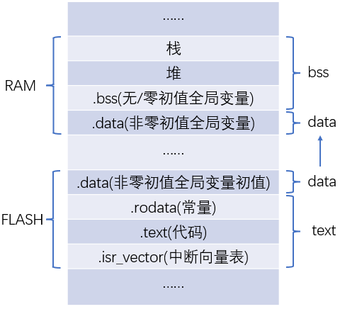

编译工程输出的代码空间占用信息如下所示
```
arm-none-eabi-size build/debug/stm32h743_azurertos.elf
   text    data     bss     dec     hex filename
  23800    2536    5504   31840    7c60 build/debug/stm32h743_azurertos.elf
```
其中各项的的含义：

项目|包含的段|存储位置|说明
-|-|-|-
text|中断向量表、代码、常量等|FLASH|
data|非零初值的全局变量等|FLASH RAM|复位后由FLASH拷贝至RAM
bss|无初值/零初值的全局变量、堆、栈等|RAM|bss全局变量复位后赋初值0
dec/hex|text + data + bss||hex为16进制值

一般情况下
* RAM占用 = data + bss
* FLASH占用 = text + data（生成的bin文件）

但当text或data中有不连续的段时，FLASH占用/bin文件会大一些，因为text与data大小都是统计各自包含的段的大小之和，而bin文件为FALSH起始至data末尾，包含了不连续的部分

> 以上统计信息由命令`arm-none-eabi-size xxx.elf`生成（Makefile中配置的），默认为`-B`选项产生单行统计输出，还可以使用`-A`选项选择更详细的输出，此外`-o -d -x`选项可以选择输出数据的进制，下面的示例中可以看出`.isr_vector`与`.text`并不连续，这种情况就会造成生成的bin文件比text+data更大
```
> arm-none-eabi-size -Ax build/debug/stm32h743_azurertos.elf
build/debug/stm32h743_azurertos.elf  :
section                size         addr
.isr_vector           0x298    0x8000000
.text                0x54ac    0x80002a0
.rodata               0x5ac    0x8005750
.ARM                    0x8    0x8005cfc
.init_array             0x8    0x8005d04
.fini_array             0x4    0x8005d0c
.data                 0x1dc   0x20000000
.bss                  0xf7c   0x200001e0
._user_heap_stack     0x604   0x2000115c
.init.AXI_RAM         0x400   0x24000000
.noinit.AXI_RAM         0x0   0x24000400
.init.SDRAM           0x400   0xc0000000
.noinit.SDRAM           0x0   0xc0000400
.ARM.attributes        0x2e          0x0
.debug_info         0x1479e          0x0
.debug_abbrev        0x353e          0x0
.debug_loc           0x71ac          0x0
.debug_aranges        0x6a0          0x0
.debug_ranges         0x7b0          0x0
.debug_line          0x8447          0x0
.debug_str           0x46ef          0x0
.comment               0x49          0x0
.debug_frame         0x1ef0          0x0
.stab                  0xb4          0x0
.stabstr              0x183          0x0
Total               0x3660c
```
> 还可以直接查看map文件的`Linker script and memory map`部分，里面有对段最详细的描述，部分示例如下（中间有省略），每个函数或者变量等所在段的详细情况都可查找到
```
...
Linker script and memory map

LOAD c:/gcc-arm-none-eabi-10.3-2021.10/bin/../lib/gcc/arm-none-eabi/10.3.1/thumb/v7e-m+dp/hard/crti.o
...
...
                0x20020000                _estack = 0x20020000
                0x00000200                _Min_Heap_Size = 0x200
                0x00000400                _Min_Stack_Size = 0x400

.isr_vector     0x08000000      0x298
                0x08000000                . = ALIGN (0x4)
 *(.isr_vector)
 .isr_vector    0x08000000      0x298 build/debug/startup_stm32h743xx.o
                0x08000000                g_pfnVectors
                0x08000298                . = ALIGN (0x4)

.text           0x080002a0     0x54ac
                0x080002a0                . = ALIGN (0x4)
...
...
.fini_array    0x08005d0c        0x4 c:/gcc-arm-none-eabi-10.3-2021.10/bin/../lib/gcc/arm-none-eabi/10.3.1/thumb/v7e-m+dp/hard/crtbegin.o
                [!provide]                PROVIDE (__fini_array_end = .)
                0x08005d10                _sidata = LOADADDR (.data)

.data           0x20000000      0x1dc load address 0x08005d10
                0x20000000                . = ALIGN (0x4)
                0x20000000                _sdata = .
 *(.data)
 *(.data*)
 .data.SystemCoreClock
                0x20000000        0x4 build/debug/system_stm32h7xx.o
                0x20000000                SystemCoreClock
...
```

### 配置AXIRAM与SDRAM段
H743内部包含多块内存，其中128K的DTCM与CPU同频，因此选作主内存，默认全局变量以及堆栈都在此块内存中（ld文件中的`.data`、`.bss`与`._user_heap_stack`段都设置在DTCMRAM）。

当需要较大的缓冲区时，可使用512K的AXIRAM(RAM_D1)，更大的内存需求，比如GUI显存则需要外部SDRAM。对于这种内存区域最直接的使用方式就是根据内存地址直接去访问，但这样需要自己管理内存，不是很方便，另一方面编译器无法得知使用情况，也就无法检测到内存用超等情况。

可以在ld文件中定义相应的段，然后定义变量时只需指定段名称，如下所示，这样就让编译器去管理内存使用了。当然也可以直接使用动态申请内存的方式去管理，本项目主要为静态使用。
```
uint8_t axi_data[1024] __attribute__ ((section (".noinit.AXI_RAM")));
```
下面以SDRAM为例介绍ld文件中段的配置以及变量初始化，AXIRAM类似。

首先在[ld文件](drivers/CMSIS/Device/ST/STM32H7xx/Source/Templates/gcc/linker/STM32H743IITx.ld)中添加SDRAM内存区域描述
```
MEMORY
{
DTCMRAM (xrw)   : ORIGIN = 0x20000000, LENGTH = 128K
RAM_D1  (xrw)   : ORIGIN = 0x24000000, LENGTH = 512K
RAM_D2  (xrw)   : ORIGIN = 0x30000000, LENGTH = 288K
RAM_D3  (xrw)   : ORIGIN = 0x38000000, LENGTH = 64K
ITCMRAM (xrw)   : ORIGIN = 0x00000000, LENGTH = 64K
FLASH   (rx)    : ORIGIN = 0x08000000, LENGTH = 2048K
SDRAM   (rw)    : ORIGIN = 0xC0000000, LENGTH = 32M
}
```
然后添加有初值与无初值两个段
```
  /* 有初值的SDRAM段(data) */
  .init.SDRAM :
  {
    . = ALIGN(4);
    _init_sdram_start = .;        /* 段起始地址, 4字节对齐, 从FLASH拷贝初值时使用 */
    *(.init.SDRAM)
    . = ALIGN(4);
    _init_sdram_end = .;          /* 段结束地址, 4字节对齐, 从FLASH拷贝初值时使用 */
  } > SDRAM AT> FLASH
  _init_sdram_lma = LOADADDR(.init.SDRAM);  /* 段在FLASH中的地址, 从FLASH拷贝初值时使用 */

  /* 无初值的SDRAM段(bss) */
  .noinit.SDRAM :
  {
    . = ALIGN(4);
    _noinit_sdram_start = .;    /* 段起始地址, 4字节对齐, 赋0初值时使用 */
    *(.noinit.SDRAM)
    . = ALIGN(4);
    _noinit_sdram_end = .;      /* 段结束地址, 4字节对齐, 赋0初值时使用 */
  } > SDRAM
```
要点：
* 段名可以自定义，但需注意是否与已有的段名有冲突，如果有冲突需要放到冲突段的前面。举个例子：假设无初值的段命名为`.bss.SDRAM`，且在`.bss*`段的后面定义，那么定义变量时段名解析会先匹配到`.bss*`从而造成链接到错误的位置，因此这种情况下需要将`.bss.SDRAM`放到前面以优先匹配。
* 有初值的段初值需要放到FLASH中，因此需要`AT> FLASH`来指定LMA（加载内存地址）为FLASH
* 有初值段需要记下起始地址、结束地址与加载地址（FLASH地址），以便复位时根据这三个地址将初值从FLASH拷贝到RAM
* 无初值段需要记下起始地址与结束地址，以便复位时赋0值

赋初值

对于默认的有初值全局变量（`.data`段）、无初值/0初值全局变量（`.bss`段），复位后进入main函数前完成初值的赋值，赋值操作具体是在[启动文件](drivers/CMSIS/Device/ST/STM32H7xx/Source/Templates/gcc/startup_stm32h743xx.s)的Reset_Handler中实现的，可以看出先调用了SystemInit，然后是从FLASH中拷贝初值到SRAM，然后是bss段赋0初值，最后进入main函数
```
Reset_Handler:
  ldr   sp, =_estack      /* set stack pointer */

/* Call the clock system initialization function.*/
  bl  SystemInit

/* Copy the data segment initializers from flash to SRAM */
  ldr r0, =_sdata
  ldr r1, =_edata
  ldr r2, =_sidata
  movs r3, #0
  b LoopCopyDataInit

CopyDataInit:
  ldr r4, [r2, r3]
  str r4, [r0, r3]
  adds r3, r3, #4

LoopCopyDataInit:
  adds r4, r0, r3
  cmp r4, r1
  bcc CopyDataInit
/* Zero fill the bss segment. */
  ldr r2, =_sbss
  ldr r4, =_ebss
  movs r3, #0
  b LoopFillZerobss

FillZerobss:
  str  r3, [r2]
  adds r2, r2, #4

LoopFillZerobss:
  cmp r2, r4
  bcc FillZerobss

/* Call static constructors */
    bl __libc_init_array
/* Call the application's entry point.*/
  bl  main
  bx  lr
.size  Reset_Handler, .-Reset_Handler
```

对于SDRAM的两个段，也可以依葫芦画瓢在Reset_Handler中这样处理，但还有一个问题是拷贝初值之前要先完成SDRAM硬件的初始化，这个操作可以放在SystemInit中实现。但这种方案一是代码比较分散，二是需要写汇编，不是很友好。

观察上面的启动文件Reset_Handler代码，可以发现进入main函数前还调用了一个__libc_init_array，这是另一种方案的关键。

> `__libc_init_array`会依次调用一个函数列表中的函数，通过`constructor`属性可以将一个函数加入到上述函数列表，此外还可以设置优先级以决定调用顺序。

因此定义一个`constructor`属性的函数，然后SDRAM硬件的初始化，变量的初始化都可以放到此函数中，甚至所有硬件初始化都可以放到此函数中，这样main函数就直接处理业务了。

SDRAM段中记录的起始终止地址在启动文件汇编代码中通过`ldr`指令进行读取，在c代码中不能直接引用。由于其不是普通的变量只是ld文件中定义的符号，因此使用有些特别，如下所示，注意即使符号本身就是地址值，但仍旧需要使用`&`取地址符。
```
extern uint32_t _init_axi_ram_start;
uint32_t *ram = &_init_axi_ram_start;
```
SDRAM完整初始化[示例](user/hardware/common.c)如下
```
__attribute__((constructor)) void sys_init(void)
{
    // MCU初始化
    // 省略···

    // SDRAM初始化
    SDRAM_Init();

    // SDRAM数据初始化
    // 从FLASH拷贝
    extern uint32_t _init_sdram_start;
    extern uint32_t _init_sdram_end;
    extern uint32_t _init_sdram_lma;
    ram   = &_init_sdram_start;
    end   = &_init_sdram_end;
    flash = &_init_sdram_lma;
    while(ram < end)
    {
        *ram++ = *flash++;
    }
    // 赋0值
    extern uint32_t _noinit_sdram_start;
    extern uint32_t _noinit_sdram_end;
    ram = &_noinit_sdram_start;
    end = &_noinit_sdram_end;
    while(ram < end)
    {
        *ram++ = 0;
    }
}
```

## FileX文件系统
### 移植关键步骤
* 添加源码（[FileX](https://github.com/azure-rtos/filex/releases)）
    * `ports`只需要`cortex_m7/gnu`
    * 其他所有
* 拷贝`common/inc/fx_user_sample.h`重命名至`user/filex/fx_user.h`，在此文件中对FileX进行配置
* Makefile中需要添加的宏定义
    * `FX_INCLUDE_USER_DEFINE_FILE`：使能`fx_user.h`配置文件
* 底层驱动
    * 读写扇区等操作，详见`user/filex/fx_sdcard_driver.c`等

### 中文支持
FileX多语言支持使用双字节Unicode编码（UTF-16的双字节部分），下面对字符集与字符编码进行简单介绍

> 给每一个字符编一个编号（code point），这些字符的集合构成`字符集`（Charset）。对于一个字符，在计算机中实际存储的值为`字符编码`（Encoding）。字符编码可能直接等于字符集中字符的编号，也可能是与字符编号有一个映射关系，这与具体的字符集相关。例如GB2312即是字符集也是其字符编码，而UTF-8则是[Unicode](https://unicode-table.com/cn/)字符集的一种字符编码。

<table>
    <tr>
        <th>字符集</th>
        <th>字符编码</th>
        <th>字符宽度</th>
        <th>说明</th>
    </tr>
    <tr>
        <td rowspan="1">ASCII</td>
        <td>ASCII</td>
        <td>1字节</td>
        <td>128个字符</td>
    </tr>
    <tr>
        <td rowspan="3">Unicode</td>
        <td>UTF-8</td>
        <td>1~4字节</td>
        <td>互联网应用最广泛，可容纳200多万个字符</td>
    </tr>
    <tr>
        <td>UTF-16</td>
        <td>2/4字节</td>
        <td>Unicode第一平面使用2个字节，其他4个字节</td>
    </tr>
    <tr>
        <td>UTF-32</td>
        <td>4字节</td>
        <td>对Unicode字符直接编码</td>
    </tr>
    <tr>
        <td rowspan="1">GB2312</td>
        <td>GB2312</td>
        <td>2字节</td>
        <td>第一个汉字编码国标，收录汉字6763个</td>
    </tr>
    <tr>
        <td rowspan="1">GBK</td>
        <td>GBK</td>
        <td>2字节</td>
        <td>兼容GB2312并进行扩展</td>
    </tr>
    <tr>
        <td rowspan="1">GB18030</td>
        <td>GB18030</td>
        <td>1/2/4字节</td>
        <td>兼容GB2312与GBK并进行扩展</td>
    </tr>
</table>

中文文本显示时多采用UTF-8或GBK等编码，因此需要进行UTF-16到相应编码的转换。本项目使用UTF-8编码，下面介绍UTF-8的编码规则。
> 对于单字节编码的字符，字节最高位为0，其他7位为Unicode码
>
> 对于N字节编码的字符，第一个字节前N位都为1，第N+1位为0，后面的字节最高两位均为10，所有字节剩余的位拼到一起为Unicode码

1~4字节编码汇总如下表所示

字节数|编码格式|有效位数|Unicode范围
-|:-|:-:|:-
1个字节|0xxx_xxxx|7|00~7F (2^7-1)
2个字节|110x_xxxx 10xx_xxxx|11|80~7FF (2^11-1)
3个字节|1110_xxxx 10xx_xxxx 10xx_xxxx|16|800~FFFF (2^16-1)
4个字节|1111_0xxx 10xx_xxxx 10xx_xxxx 10xx_xxxx|21|10000~1FFFFF (2^21-1)

由上表可得UTF-16转UTF-8算法：根据字符UTF-16值的范围确定UTF-8编码字节数，再根据相应编码格式完成转换。详细算法见文件`user/app/thread_file.c`中的`utf16_to_utf8`函数。

> 以`"中"`字为例说明一下字节序的问题。
> 
> 在[查看字符编码(UTF-8)](http://www.mytju.com/classcode/tools/encode_utf8.asp)网站可以查到`"中"`的Unicode值为`4E2D`，UTF-8编码为`E4B8AD`。其中`4E2D`为一个16位数值，低字节为`2D`高字节为`4E`，实际在UTF-16字符串中`2D`在前`4E`在后（小端）。而`E4B8AD`不是一个数值而是三个字节的序列，UTF-8字符串中`E4`在最前。UTF-16转UTF-8时，从UTF-16的低字节低位开始填充UTF-8的最后一个字节(10xx_xxxx)，最后UTF-16高字节的剩余部分填充UTF-8的第一个字节(1110_xxxx)。

UTF-16转GBK的话没有固定的规律，需要一张包含每个字符的Unicode到GBK映射的转换表。转GB2312等其他中文编码也是一样的原理。

## FMC接口驱动NandFlash
### NandFlash介绍
本文使用的NandFlash型号为H27U4G8F2E，这是一块海力士的8bit×512M的NandFlash，具体参数特性如下
* 尺寸参数
    * 2个plane
    * 每个plane 2048个block
    * 每个block 64个page
    * 每个page 2048字节（data area） + 64字节（spare area）
* 典型时间特性
    * 串行读：25ns/字节
    * 页访问：25us
    * 页编程：200us
    * 块擦除：3.5ms
* 最小擦除单位是block，擦除后全1，写操作只能写0不能写1
* SLC单层单元
* 兼容Open NAND Flash Interface([ONFI](http://www.onfi.org/)) 1.0
* 支持内部数据拷贝功能(copy-back)
* 2个plane并行操作
* 10万次擦写编程循环

### 引脚定义与功能
引脚|说明
-|-
DQ0-DQ7|数据输入输出，命令、地址、数据复用                                                                                                                |
CLE|命令锁存使能，高电平有效表示DQ为命令
ALE|地址锁存使能，高电平有效表示DQ为地址
CE#|芯片使能，低电平有效
RE#|读使能，下降沿后tREA数据有效
WE#|写使能，上升沿时锁存命令(CLE有效)、地址(ALE有效)或数据(CLE与ALE均无效)
WP#|写保护，低电平有效禁止擦写
RB#|就绪/忙，开漏输出指示状态，可通过命令读取状态而不使用此信号


### 总线操作
共有6种标准总线操作如下表所示，对FLASH的读写擦除等操作由其中前4种的一种或几种操作构成。
操作|说明
-|-
命令输入|在CE#低、CLE高、ALE低、RE#高时，在WE#的上升沿锁存
地址输入|需要5个周期，在CE#低、ALE高、CLE低、RE#高时，在WE#的上升沿锁存
数据输入|WE#控制下串行输入，在CE#低、ALE低、CLE低、RE#高时，在WE#的上升沿锁存
数据输出|在CE#低、ALE低、CLE低、WE#高时，按照RE#的周期串行移出数据
写保护|WP#低电平时硬件写保护被激活，此时存储器的内容无法更改
休眠|standby状态，设备被取消选择，输出禁用，功耗降低

### 存储器地址
512MB空间需要29位地址，加上spare area则需要再多一位共30位地址，记为A0-A29，其中地址位定义如下表所示
地址位|定义|说明
-|-|-
A0-A11|列地址，即页内的字节地址|寻址2KB+64B，12位最大可寻址4KB，由此可知页末尾地址与相邻下一页起始地址并不连续
A12-A17|块内的页索引|6位地址寻址64，对应一块包含64页
|A18|plane地址|plane地址位于块地址的低位，由此可知block按地址排序则会在两个plane中逐个交替
|A19-A29|块地址|也可定义A18-A29为块地址，则12位地址寻址4096对应两个plane一共4096个block

与A0-A11为列地址（Column Address）相对应，A12-A29称为行地址（Row Address），这30位地址分5个周期传输，排列如下表所示
周期|DQ7|DQ6|DQ5|DQ4|DQ3|DQ2|DQ1|DQ0
-|-|-|-|-|-|-|-|-
第1周期|A7|A6|A5|A4|A3|A2|A1|A0|
第2周期|0|0|0|0|A11|A10|A9|A8|
第3周期|A19|A18|A17|A16|A15|A14|A13|A12|
第4周期|A27|A26|A25|A24|A23|A22|A21|A20|
第5周期|0|0|0|0|0|0|A29|A28|

### FMC控制器
我们写驱动代码操作NandFlash时并不要需要直接去实现手册里的那些读写时序，而是通过配置与操作单片机的NandFlash控制器来实现这些时序，这样能大大简化代码工作并节省CPU资源。对于H7来说即FMC控制器，即我们要写的NandFlash驱动其实就是FMC驱动。下面介绍怎样根据手册中的时序去配置FMC中的参数。

FMC中时序相关的参数有6个，包括下图中的4个（MEMSET、MEMWAIT、MEMHOLD、MEMHIZ）以及TCLR与TAR，注意下图中命名与FLASH手册命名不同，红字标出了FLASH手册中对应的名称

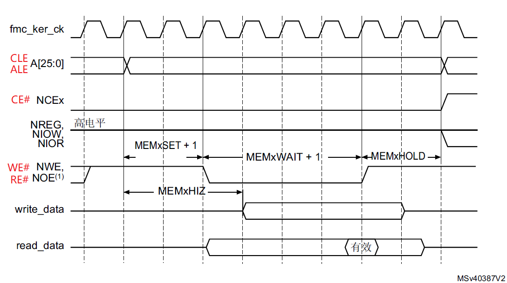

以命令锁存时序为例进行说明，下图为NANDFlash手册中的命令锁存时序

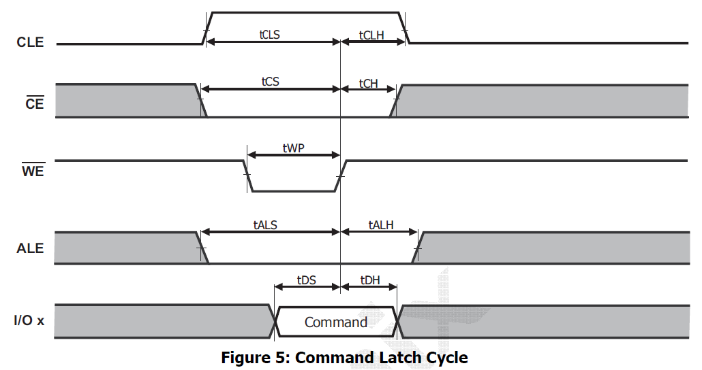

* **MEMSET**为命令使能前地址建立的时间，即CLE或ALE变高至WE#或RE#变低的时间。对于上图中的命令锁存即为tCLS-tWP，但手册中只给出了tCLS的最小值12ns与tWP的最小值12ns，两个最小值无法得到差的最小值。也有文章直接将tCLS及tALS当作此建立时间考虑。本文实测最小可配置为5ns，即MEMSET=0。


* **MEMWAIT**为命令使能的最小持续时间，即WE#或RE#的低电平时间（tWP与tRP）。对于上图中的命令锁存即为tWP，手册中最小值为12ns。tRP最小值同样为12ns，FMC时钟周期为5ns，因此理论最小可设3个周期15ns。但本文实测最小需配置25ns，即MEMWAIT=4。

* **MEMHOLD**为命令结束后，地址信号（写的话还有数据信号）的保持时间，即WE#或RE#变高至CLE或ALE变低的时间（tCLH与tALH）。对于上图中的命令锁存即为tCLH，手册中最小值为5ns。tALH最小值同样为5ns，FMC时钟周期为5ns，因此理论最小可设1个周期5ns，保险起见设置２个周期10ns。由于写访问保持时间为MEMHOLD而读访问保持时间为MEMHOLD+1，因此设置MEMHOLD=2，此时写访问10ns读访问15ns。

* **MEMHIZ**为开始写访问后数据总线高阻态时间，即CLE或ALE变低至IO上数据有效的时间。对于上图中的命令锁存即为tALS-tDS，但手册中只给出了tALS的最小值12ns与tDS的最小值12ns，两个最小值无法得到差的最小值。不过这个时间与MEMSET类似，也以尝试取与MEMSET一样的值。本文实测最小可配置为5ns，即MEMHIZ=0。

* **TCLR**配置CLE低电平到RE#低电平的时间，即FLASH手册中的tCLR（CLE to RE# Delay）。计算公式为tCLR=(TCLR+MEMSET+2)*T（T=5ns），手册中tCLR最小值为10ns，则MEMSET=0时，TCLR最小值为0，保险起见可设置TCLR=1。

* **TAR**配置ALE低电平到RE#低电平的时间，即FLASH手册中的tAR（ALE to RE# Delay）。计算公式为tAR=(TAR+MEMSET+2)*T（T=5ns），手册中tAR最小值为10ns，则MEMSET=0时，TAR最小值为0，保险起见可设置TAR=1。

### 读状态
本文以最简单的读状态来介绍操作时序，读状态时序如下图

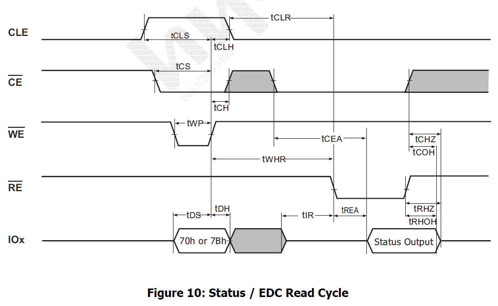

上述时序看起来复杂但实现却很简单，可主要分为写命令字和读状态值两个部分，写命令只需将命令字写入FMC命令区域任意地址即可，读状态结果则是读取FMC数据区域任意地址即可，具体的命令与数据时序由FMC根据初始化时的配置自动完成。

注意时序中发完命令至读取状态结果有一个tWHR的时间，这个时间FMC的配置中并没有，但手册中有最小60ns的要求。观察时序图可以看出tWHR=tCLH+tCLR，FMC中tCLH与tCLR配置均为15ns，则tWHR=30ns<60ns并不满足时序要求，需要在写命令与读状态之间增加额外至少30ns的延时。但实测发现不增加此延时也能正常读到状态值，使用示波器测量此时实际的tWHR值为51.2ns（下图是测量结果，使用的正点原子DS100示波器，由于带宽不足波形已经严重失真，这个时间只能大致参考，图中黄色为RE#、绿色为WE#）。这里实际与手册的差异暂没搞清楚怎么回事，保险起见代码里直接在写指令与读数据之间增加60ns的延时。

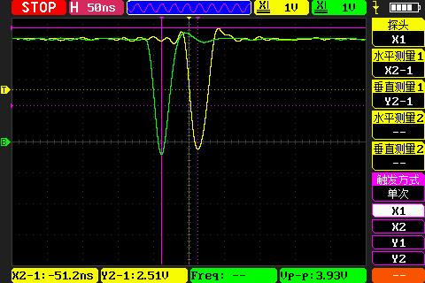

经过以上分析最终读状态操作步骤如下：
* 写入命令0x70
* 延时tWHR
* 读状态值

> 注意进入读状态模式后，除非有新的指令，否则将一直处于该模式。因此在读页操作中，读取状态后需要发送一个0x00指令再开始读取页数据。

### 复位

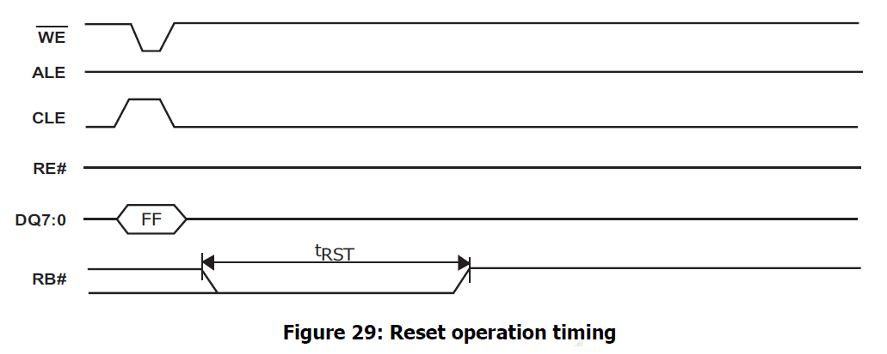

复位操作步骤：
* 写入命令0xFF
* 延时tWB
* 循环读ready状态（tRST超时）

### 读页

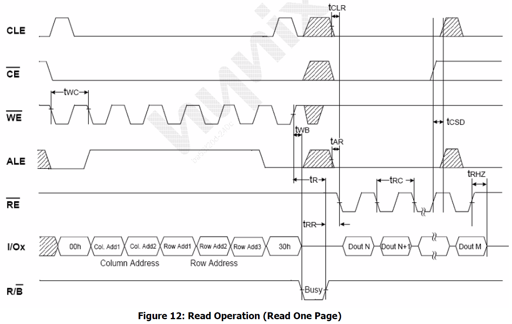

读页操作步骤：
* 写入命令0x00
* 写入地址
* 写入命令0x30
* 延时tWB
* 循环读ready状态（tR-tWB超时）
* 写入命令0x00
* 读数据

> 关于循环读ready状态的超时时间：
按照时序busy状态持续时间为tR-tWB，可近似为tR（tWB与tR相比很小），手册中tR最大值为25us，因此理论上超时时间设置为25us即可，但实际25us总是发生超时，示波器测量RB#电平时间发现大于25us，如下图所示（绿色为RB#信号），因此超时时间要设置长一些，代码中设置的为50us
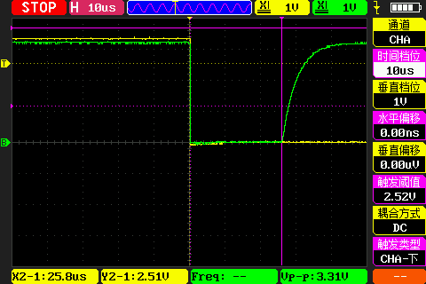

> 关于写入命令0x00后的延时
读数据之前的时然序有tRR与tCLR。由于ready状态（RB#升沿）之后有一个写0x00命令的操作，因此tRR（Min=20ns）必满足。而tCLR是由FMC自动控制的，因此理论上写入命令0x00之后代码无需延时即可读取数据。用示波器测量tCLR结果如下，87.5-72.6=15ns与配置值一致，满足要求。由于示波器只有两路，因此CLE与RE#分两次测量，图中黄色为便于测试控制GPIO输出的基准信号，左图绿色为CLE信号，右图绿色为CE#信号，两个信号的时间差即为tCLR。
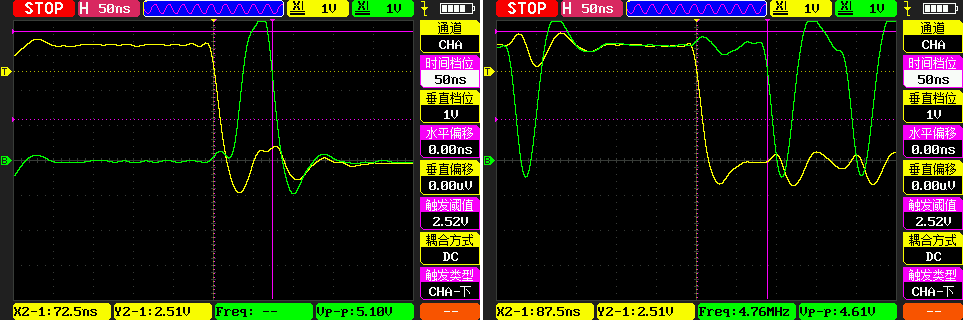

### 写页

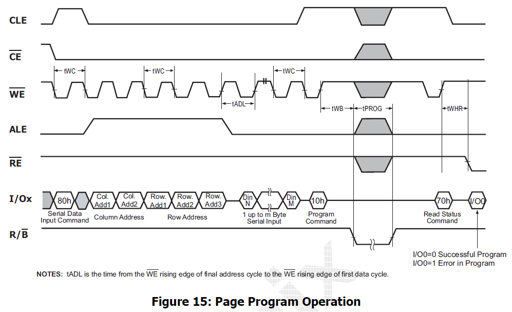

写页操作步骤：
* 写入命令0x80
* 写入地址
* 延时tADL
* 写入数据
* 写入命令0x10
* 延时tWB
* 循环读ready状态（tPROG超时）

### 擦除块

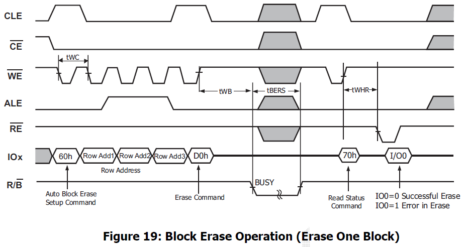

擦除块操作步骤：
* 写入命令0x60
* 写入地址
* 写入命令0xD0
* 延时tWB
* 循环读ready状态（tBERS超时）

> 本文未介绍的如copy-back、CE don't-care、多plane并行等一些高级特性可参考[此文](https://www.cnblogs.com/yuanqiangfei/p/9400435.html)。

### ECC校验

**ECC简介**

与NorFlash相比，NandFlash具有成本低容量大的优点，但同时也具有数据读写更容易出错的缺点，所以一般都需要ECC数据校验措施，每页最后的spare area区域用途之一就是存放ECC校验值。

ECC（Error Code Correction或者Error Checking and Correcting）是一种差错检测和修正算法，可以检测特定长度（2的整次幂）数据中2个bit以内的错误和修正1个bit的错误。

**ECC校验值生成原理**

将数据按位排列（假设共Nbit），以不同的步长（1bit、2bit、4bit、8bit、16bit、…、N/2bit）交替将数据等分为两个部分，将每个部分所有位进行异或即得到ECC结果中的一位。由此可知ECC校验值位数为数据二等分方式数的2倍，即ECC有效位数=2log2(数据总位数），例如256字节数据的有效ECC位数为2log2(256*8)=22bit。下图展示了2字节数据的ECC计算原理。

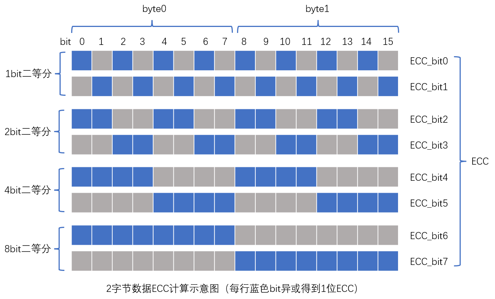

实现上述算法时一般会将数据按照一个字节或者两个字节一行排列成一个表，然后分别计算行校验与列校验，最后将行列校验组合起来形成ECC校验值（上面的ECC原理介绍相当于只有一行的表）。这样做的好处是方便加快计算速度，以一个字节一行为例，可以提前计算值0x00~0xFF的行列极性组成极性表，然后结合查表一次循环（按字节）即可计算出所有行列校验值，Linux内核中ECC计算便是使用此算法，[算法实现详细介绍见此文]( https://www.pianshen.com/article/2306657069/)。LevelX中的ECC算法使用的两个字节一行的算法，没有使用预计算的极性表（一个字节时极性表大小为256字节，两个字节的表则需要64KB，对存储占用太大）。

无论是哪种实现本质是一样的，因此计算得到的ECC结果必然也一样，但是注意不同的算法的ECC值内部bit可能有不同的排列方式，因此比较不同算法结果的话需要统一排列方式。

**硬件ECC计算**

H7的FMC控制器包含ECC硬件计算模块，支持每256、512、1K、2K、4K、8K个字节计算ECC。开启此功能后，FMC自动对读写的数据流进行ECC计算，结果存储在相应寄存器中。因此实际本项目代码中不用实现上述ECC生成算法，而是控制ECC硬件模块完成ECC计算。

本项目采用每256字节计算ECC，这样能应对最多的出错情况，另一方面ECC占用存储也最多。不过对于2K+64的页：2K/256*3字节（ECC有效22位）=24字节，还不到64字节的一半，因此存储空间完全没问题。由于每256字节计算ECC，对于2KB的页读写时需要分8次进行以获取每个256字节数据的ECC。

硬件ECC使用步骤如下，每页需要重复以下步骤8次
* 启动ECC
* 读/写256字节数据
* 阻塞读取ECC结果
* 关闭ECC

**ECC使用（纠错）**

写数据时计算ECC并写入spare area，读数据时计算ECC并和从spare area读出的ECC进行比较，根据比较结果完成纠错。和ECC计算一样，纠错算法也有不同的实现方式，本质上都是上面链接文章最后提到的二分判决过程。本项目使用下述方式（要保证ECC内部bit排列是上图示例中的排列方式）：
* 新旧ECC相等的话说明没有错误，否则二者进行异或，注意ECC有效位数
* 异或结果的bit0-1、bit2-3...以此类推全是01b或10b的话说明有1个bit翻转，异或结果奇数bit组成的数即为翻转bit的总索引（全部数据按位排列的位索引）
* 其他情况则表示无法纠正的错误

## LevelX闪存磨损均衡
最新版LevelX-6.2.1相比之前有很大的变化，但是相关文档并没有更新，本项目暂时仍旧使用旧版的LeveX-6.1.11

### 移植关键步骤
* 添加源码（[LevelX](https://github.com/azure-rtos/levelx/releases/tag/v6.1.11_rel)）
    * 注意删除或者在Makefile中排除源文件中的2个文件系统示例文件`common/src/fx_*.c`
* 拷贝`common/inc/lx_user_sample.h`重命名至`user/levelx/lx_user.h`，在此文件中对LevelX进行配置
* Makefile中需要添加的宏定义
    * `LX_INCLUDE_USER_DEFINE_FILE`：使能`lx_user.h`配置文件
* 底层驱动
    * NandFlash页读写及块擦除等操作，详见`user/levelx/lx_nand_driver.c`

### 配置
* 需要开启直接映射缓存选项（`lx_user.h`中定义`LX_NAND_FLASH_DIRECT_MAPPING_CACHE`宏）, 否则写未映射的sector会耗时数百ms(因为每次_lx_nand_flash_logical_sector_find会遍历全部block)
* 开启了直接映射缓存则需要设置Cache大小为Flash总页数（`lx_user.h`中配置`LX_NAND_SECTOR_MAPPING_CACHE_SIZE`宏）
* 以上配置会造成LX_NAND_FLASH实例很大（>1MB），因此需要定义到SDRAM中
* 为了读写页数据之后不用再发送地址而直接能够继续访问ECC，NandFlash驱动中ECC值放在了spare area的起始位置，因此LevelX中坏块标志等其他信息放置在了spare area的字节32之后

## USBX
移植关键步骤（MSC设备, NandFlash模拟U盘）
* 添加源码（[USBX](https://github.com/azure-rtos/usbx/releases)）
    * `ports`只需要`cortex_m7/gnu`
    * 其他所有
* 添加源码（[usbx_stm32](https://github.com/STMicroelectronics/x-cube-azrtos-h7/tags)）
    * `Middlewares\ST\usbx\common\usbx_stm32_device_controllers`（用于USB设备）
    * `Middlewares\ST\usbx\common\usbx_stm32_host_controllers`（用于USB主机）
* 拷贝`common/core/inc/ux_user_sample.h`重命名至`user/usbx/ux_user.h`，在此文件中对USBX进行配置
* 拷贝`x-cube-azrtos-h7`中任一示例项目的`ux_stm32_config.h`至`user/usbx/ux_stm32_config.h`，在此文件中配置usbx_stm32
* 实现USB设备初始化、MSC描述符、MSC驱动等内容，详见`user/usbx`中相关代码
* Makefile修改
    * 添加源代码及头文件列表，详见文件
    * 添加宏定义`UX_INCLUDE_USER_DEFINE_FILE`：使能`ux_user.h`配置文件

## 开关机
开关机电路详见原理图，通过锂电池充放电管理芯片输出与DCDC输入之间的PMOS控制供电通断，长按开关机键实现开机或关机，具体实现方式见下表

PMOS控制方式|导通条件|业务逻辑
-|-|-
开关机按键|按下时PMOS导通，松开时截止或由其他方式控制导通|关机状态按下时PMOS导通程序开始运行，满足长按时间后程序控制GPIO输出高以保证按键松开后仍能维持PMOS导通；开机状态检测到长按时控制GPIO输出低以不再维持PMOS导通，待按键松开则PMOS截止完成关机
电源控制GPIO|输出高时PMOS导通，否则截止或由其他方式控制导通|配合开关机按键实现开关机功能
USB供电|接通USB时PMOS导通，否则截止或由其他方式控制导通|用于关机状态下连接USB时能够显示充电状态

## 触摸按键
触摸按键电路详见原理图，触摸PAD相当于一个电容，手指触摸时会增大此电容的值，通过测量电容充电时间来判断是否触摸。

程序以10ms周期处理触摸按键，先是控制GPIO输出低给电容放电，5ms后GPIO改为浮空输入（定时器捕获通道）电容开始充电并将计数器清零，充到高电平阈值时定时器会捕获到一个上升沿，此捕获时间大于阈值则认为触摸按键处于按下状态。

## 红外遥控
使用NEC格式，主要包含引导码与32bit数据。一次按键的编码格式如下图，依次是引导码、8bit地址、8bit地址反码、8bit键值、8位键值反码、停止位。

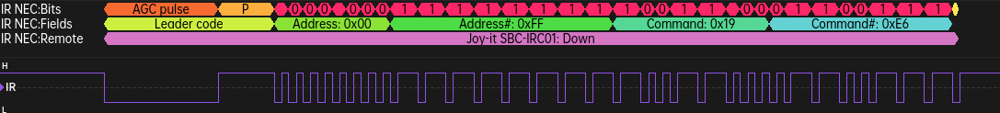

遥控器按键长按时，以108ms的周期持续发出编码，第一次为上面的格式，后面使用连发码代替，如下图所示

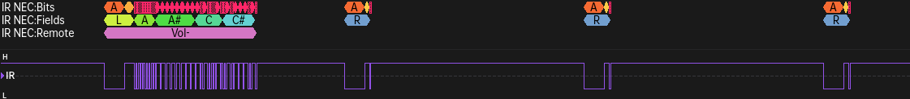

上面涉及的四种码字波形分别如下

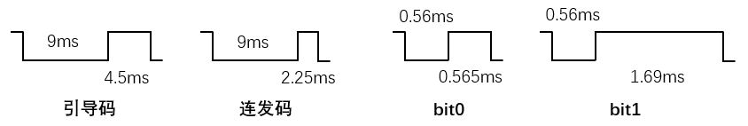

解码时可使用码字标准脉宽的上下各10%的范围做判断，先判引导码或连发码，然后再逐位判比特0或1，32位数据有效则判按键按下，至停止位后一个周期(108ms)内没有连发码的话判按键抬起。

## 充电
### BQ25606
使用TI的BQ25606独立单节锂电池3.0A开关充电器进行充放电管理，主要特性如下
* 输入电压3.9V-13.5V，输入限流0.5A-3.2A
* 充电电压限制4.208V/4.352V/4.400V，充电限流0.3A-3A
* 支持BC1.2以及非标准适配器
* OTG输出5.15V最大1.2A
* 支持无电池输出以及输出短路保护

充放电拓扑结构如下图所示

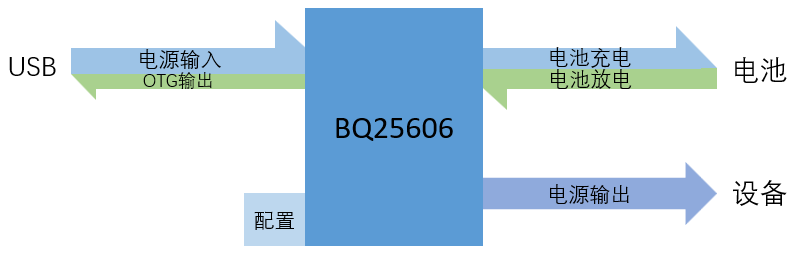

### LTC2941（电池电量库仑计）
使用ADI（亚德诺）的LTC2941电池电量计，其工作范围非常适合单节锂离子电池，主要特性如下
* 指示累计电池充放电
* 电池正极采样
* 1%充电精度
* ±50mV电压检测范围
* SMBus/I2C接口（7位地址1100100）
* 可配置报警输出/充电完成输入
* 电压范围2.7V~5.5V

典型应用见下图，电池正极串联一个采样电阻（根据不同的充放电电流选择不同的阻值）。库仑计通过测量采样电阻两端电压计算电池电流，然后对电流进行积分得到电荷量，结果存储在内部寄存器中，通过SMBus/I2C接口访问

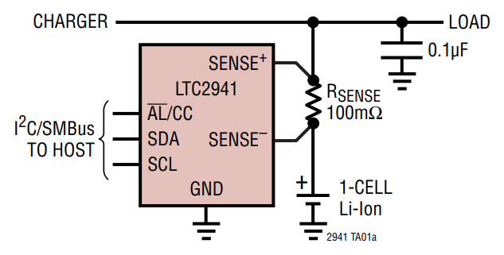

寄存器定义见下表
地址|名称|描述|读/写|默认值
-|-|-|-|-
00h|A|状态寄存器|R|见下表
01h|B|控制寄存器|R/W|3Ch
02h|C|电荷量高字节|R/W|7Fh
03h|D|电荷量低字节|R/W|FFh
04h|E|电量上阈值高字节|R/W|FFh
05h|F|电量上阈值低字节|R/W|FFh
06h|G|电量下阈值高字节|R/W|00h
07h|H|电量下阈值低字节|R/W|00h

状态寄存器A（只读）见下表
位|名称|描述|默认值
-|-|-|-
A[7]|芯片标识|1：LTC2941，0：LTC2942|1
A[6]|保留|未使用|0
A[5]|电荷量寄存器溢出|电荷量寄存器发生上溢或下溢|0
A[4]|保留|未使用|0
A[3]|高阈值报警|电荷量超过高阈值|0
A[2]|低阈值报警|电荷量低于低阈值|0
A[1]|电池电压报警|电池电压（$V_{SENSE-}$）低于设定的电压阈值|0
A[0]|欠压锁定报警|欠压锁定（$V_{SENSE+}<2.7V$）后模拟部分关闭，寄存器值保持|X

控制寄存器B见下表
位|名称|描述|默认值
-|-|-|-
B[7:6]|电池电压阈值|11：3.0V，10：2.9V，01：2.8V，00：不报警|00
B[5:3]|预分频M|$M=2^{B[5:3]}$（1~128，默认128）|111
B[2:1]|报警/充电完成|配置AL#/CC引脚功能。10：报警模式，引脚为输出；01：充电完成模式，引脚为输入；00：引脚禁止；11：保留|10
B[0]|低功耗|关闭模拟部分以减少功耗|0

AL#/CC引脚设置为报警模式时，电荷量发生溢出或者超过阈值上下限均会造成引脚拉低；设置为充电完成模式时，高电平输入表示充电完成，此时电荷量寄存器被置为FFFFh，一般连接充电电路的充电完成输出。

为了保证库仑计的精度，SENSE+与SENSE-之间的电压不能超过±50mV（最高±300mV也能工作但不能保证精度），再结合最大充电电流，可按下式估计采样电阻的值
$$R_{SENSE}=50mV/I_{MAX}$$

> 此外需注意，电池容量相对于最大电流非常大或者非常小时，仍按上式选择采样电阻可能造成电荷量寄存器溢出（计数到FFFFh时仍未充满）或者使用过少（精度过差）。此时需要适当调整采样电阻值以及预分频因子M，详见芯片手册。

### 适配器检测
充电时输入电流不能超过适配器的电流提供能力，因此插入电源时需要检测适配器类型（如不同型号的手机充电头）以决定能使用的充电电流。BQ25606支持USB电池充电规范BC1.2(Battery Charging Specification 1.2)以及非标准适配器，插入电源后依次进行如下3种检测

#### 1、BC1.2检测
BC1.2使用USB电缆中的D+和D-定义不同的充电端口（即不同的电流提供能力），具体定义如下表
端口类型|端口特征|供电能力
-|-|-
标准下行端口SDP（Standard Downstream Port）|标准数据端口（主机），D+和D-线上均有15kΩ的下拉电阻|500mA(USB2.0) / 900mA(USB3.x)
专用充电端口DCP（Dedicated Charging Port）|不支持数据传输，D+和D-线短路（最大阻抗200Ω）|1.5A
充电下游端口CDP（Charging Downstream Port）|在标准下行端口基础上，可在D+和D-上检测与施加电压（0.5V-0.7V），通过D+和D-上的电压识别|1.5A

BQ25606仅支持SDP与DCP，且SDP限流500mA，DCP限流2.4A。

#### 2、非标准适配器检测
如果BC1.2检测超时，则进行非标准适配器检测。非标准适配器用来区分不同厂商的特定适配器，BQ25606的支持4种非标准适配器如下表
非标适配器|D+阈值|D-阈值|输入电流限制
-|-|-|-
Divider 1|2.55V-2.85V|1.85V-2.15V|2.1A
Divider 2|1.05V-1.35V|1.05V-1.35V|2A
Divider 3|1.85V-2.15V|2.55V-2.85V|1A
Divider 4|2.55V-2.85V|2.55V-2.85V|2.4A
下图列出了BQ25606支持的几种厂商特定适配器

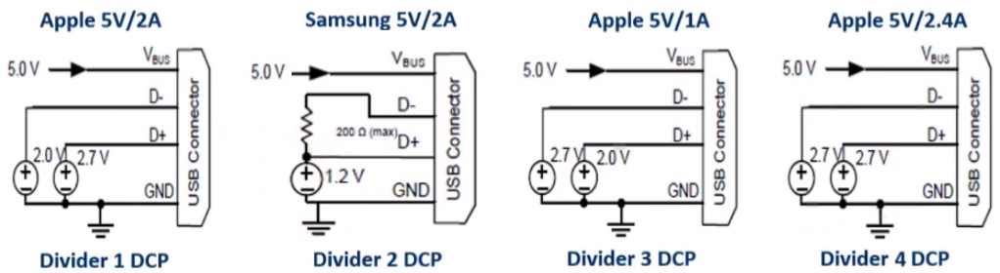

#### 3、未知适配器
如果适配器未被检测为上述非标准适配器，则为未知适配器。此时电流上限由 ILIM 引脚到地的$R_{ILIM}$电阻确定，$I_{INMAX}=K_{ILIM}/R_{ILIM}$（$K_{ILIM}$典型值为478AΩ）

> 还有一种使用Type-C但不使用PD协议的情况（BQ25606并不支持），源端固定提供5V电压，电流最大可达3A，设备端通过CC线而非D+/D-判断源端电流能力。源端CC通过电阻Rp上拉或者使用电流源，设备端CC使用5.1kΩ的电阻下拉，源端不同的上拉电阻或者不同的电流源代表不同的供电能力。二者连接后设备端通过检测CC上的电压值判断源端的电流提供能力，标准电流能力有三档如下表（详见下文Type-C电源协商小节）
> 电流能力|CC线电压
> -|-
> 500mA(USB2.0) / 900mA(USB3.x)|约0.41V
> 1.5A|约0.92V
> 3A|约1.68V

### 电池
经过上述适配器检测只是知道了输入电流的上限，实际使用多大的电流去充电还要看电池参数。锂电池充电电流一般用充电倍率C表示，C为充电电流与电池容量的比值。例如对于3000mAh的电池，0.5C充电即1.5A电流，1C充电即3A电流。只考虑恒流充电时，1C即1小时充满，0.5C则2小时充满，实际充电过程不是一直恒流因此比理论时间会长一些。充电倍率越大充电越快，倍率越小则对电池寿命越有利。一般平衡考虑充电时间与电池寿命，可选用0.5C的充电倍率。当然还要看具体型号电池的参数，例如现在支持快充的手机，可能使用3C甚至更高的充电倍率。本项目使用的电池参数如下表所示

参数|值
-|-
容量|3200mAh
电压|标称3.7V、最低存储3.7V、放电截止2.75V
充电电流|标准0.1C（15h）、快速0.5C（2.5h）、最大1C
放电电流|连续0.5C、最大1C

BQ25606充电电流上限由 ICHG 引脚到地的$R_{ICHG}$电阻确定，$I_{CHG}=K_{ICHG}/R_{ICHG}$（$K_{ICHG}$典型值为677AΩ）。

> **输入电流（适配器输出电流）与电池充电电流的关系：**
> 充电过程本质上是能量从适配器转移至电池的过程，即输入功率等于充电功率与热损耗功率之和。不考虑热损耗时，输入电流与充电电流近似满足以下条件：$I_{充电}=U_{输入}/U_{电池}{\cdot}I_{输入}$。此外，实际使用时除非关机充电，设备本身还要消耗部分输入功率。

## Type-C与PD
### USB Type-C
下文中Type-C相关内容主要翻译自USB Type-C Spec R2.1
#### Type-C插座与插头
Type-C的插座与插头引脚定义见下图（[图片来源](https://www.richtek.com/Design%20Support/Technical%20Document/AN056?sc_lang=zh-TW)）
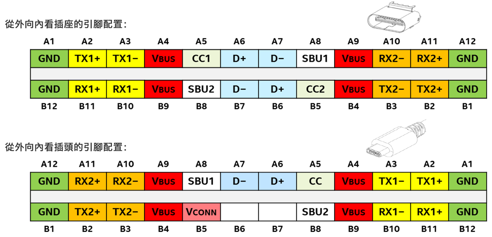
Type-C插座上共有24个引脚，对于特定的平台或设备，并非所有引脚都会用到，例如RX与TX引脚只有USB3.x及以上版本才会用到。Type-C插头也是如此，只用到部分引脚。电缆中只有一条CC线连接至CC引脚用于建立信号方向等功能，另一个CC引脚则用于给VCONN供电。此外，电缆中只包含一对D+/D-线用于USB2.0通信。对于Type-C Power-Only插头（例如电源适配器），仅使用VBUS、GND、CC共9个引脚。具体引脚描述见下表
引脚|分组|描述
-|-|-
TX1+、TX1-、RX1+、RX1-、TX2+、TX2-、RX2+、RX2-|USB3.2/USB4|数据通道差分发送与差分接收对，分别有两组以支持双通道以及正反插特性
D+、D-|USB2.0（LS/FS/HS）|一组数据差分对，插座上有两组引脚以支持正反插
CC1（插座）、CC2（插座），CC（插头）|配置|用于连接检测、接口配置以及VCONN供电
SUB1、SUB2|辅助信号|边带（SideBand）使用，对于音频配件模式用于MIC、AGND，对于USB4用于SBTX、SBRX
VBUS、VCONN（插头）、GND|电源|总线电源、插头电源（eMarker供电）与地

#### 配置通道（Configuration Channel，CC）

USB Type-C插座、插头和电缆解决方案包含一个配置过程，用于检测DFP到UFP（或Source到Sink）的连接，以确定VBUS供电方向以及USB Host与Device关系。Type-C插座上的两个引脚CC1和CC2用于此目的。在标准USB Type-C电缆中，电缆的每个插头内只有一个CC引脚位置通过电缆连接。配置过程包含的功能如下
* Source-to-Sink插入/分离检测
  * 插入检测通过Source感知CC线上的对地电阻实现，分离检测则通过感知对地电阻的消失实现
  * Source检测到Sink插入之前不会向VBUS或VCONN供电，检测到插入后才会供电，且检测到分离后会停止供电
* 插头方向/电缆扭曲检测
  * 通过CC线检测插头插入的正反以及电缆是否扭曲（两端插入正反是否一致），USB3.x据此配置数据通道链路
* 初始电源（Source/Sink）与数据关系（Host/Device）
  * 与Type-A/B不同，Type-C无法根据插座/插头的机械特性确定端口角色，需要利用CC线建立初始电源与数据关系
  * 电源角色包含Source-only、Sink-only、DRP三种类型，数据角色包含DFP-only、UFP-only、DRD三种类型
  * DFP-only与UFP-only连接对应传统Host与Device连接，但不一定存在数据通信
  * 建立初始连接后，Source作为DFP，Sink作为UFP，两个端口都支持PD协议时可以使用PD交换电源与数据角色
  * DRP连接到DRP时，通过CC引脚上的协议建立Host与Device关系，在没有角色交换干预的情况下，从用户角度看最终哪端是DFP哪端是UFP是随机的
  * USB集线器上包含两种端口，一个Sink/UFP和多个Source/DFP
* VBUS电流检测与使用
  * 通过CC线公布5V时的电流上限，最大3.0A
* PD通信
* 功能扩展
  * 备用模式（Alternate Mode）

配置通道用于以下目的
* 检测端口连接
* 检测电缆方向以及电缆扭曲
* 建立数据角色
* 发现和配置VBUS：Type-C电流模式或者PD协商
* 配置VCONN
* 发现和配置可选的备用和配件模式

#### 数据总线接口与插头翻转

由于Type-C插头允许正反插，因此USB Host和Device之间的数据通信需要适应不同的连接状态。下图为单通道数据总线路由的逻辑模型，主机和设备之间的USB电缆可能处于以下四种连接状态之一
* 正插直连（图中蓝色实线①-①）
* 正插扭曲（图中蓝色虚线①-②）
* 反插直连（图中红色虚线②-②）
* 反插扭曲（图中红色实线②-①）
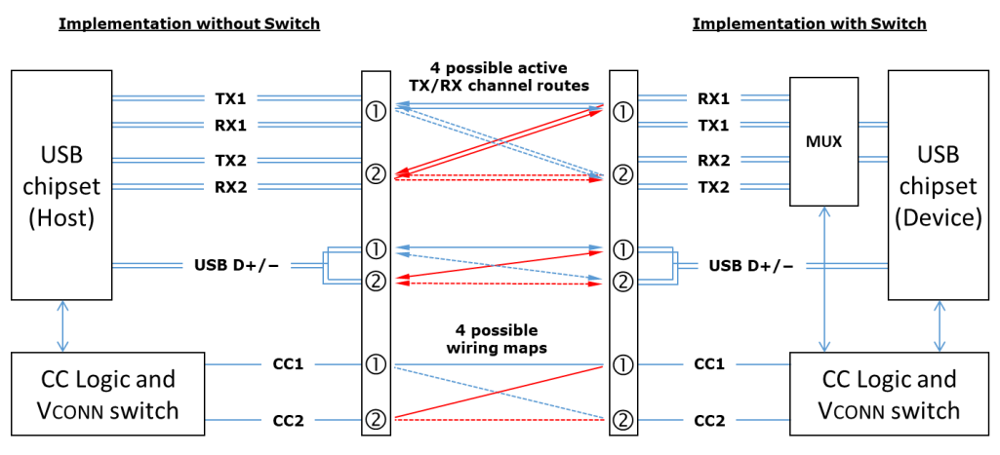

* 对于USB2.0通信，Type-C插座中的两个D+引脚以及两个D-引脚均短接在一起，因此4种电缆连接状态完全等效无需区分
* 对于单通道USB3.2或USB4通信，需要主机或设备中的数据通道切换功能，以将TX/RX信号路由至正确的路径。为了能在主机和设备之间建立正确的数据总线路由，标准USB Type-C电缆内部单个CC线与第一个TX/RX信号组（TX1+、TX1-、RX1+、RX1-）位置对齐，这样通过检测插座处的CC引脚（CC1与CC2）哪一个被对端连接，主机或设备便能确定哪组TX/RX信号用于单通道通信，并据此控制路由开关
* 对于双通道通信，与CC线对齐的TX/RX信号组为通道0（Lane 0，USB3.2中应识别为配置通道），另一个信号组则为通道1（Lane 1）

#### 连接Source与Sink

与Type-A/B不同，Type-C无法根据插座/插头的机械特性确定端口角色，也无法限制特定的连接，因此Source-only、Sink-only、DRP三种端口可以任意两两组合连接。如果发生Source-only到Source-only的连接或Sink-only到Sink-only的连接，此时不会损坏端口但也不会实现任何功能。而这两种连接之外的其他所有连接都是有效的连接。
Source（Host）与Sink（Device）连接的接口配置典型流程如下
* 检测端口之间的有效连接（包括确定电缆方向、Source/Sink关系、DFP/UFP关系）
* （可选）了解电缆功能（eMaker）
* （可选）建立传统USB供电的替代方案
  * 通过CC进行USB PD通信，用于高级供电协商
  * USB Type-C电流模式
  * USB BC 1.2
* USB设备枚举

对于DRP连接到Source-only、Sink-only或另一个DRP的情况，该过程基本相同。只是在检测有效连接步骤期间，DRP在作为Source检测Sink连接和作为Sink检测Source连接两种状态之间交替，最终完成Source与Sink的连接

使用上拉（Rp）和下拉（Rd）模型来定义CC的功能行为，Source的上拉电阻也可使用电流源替代，上下拉CC模型如下图所示
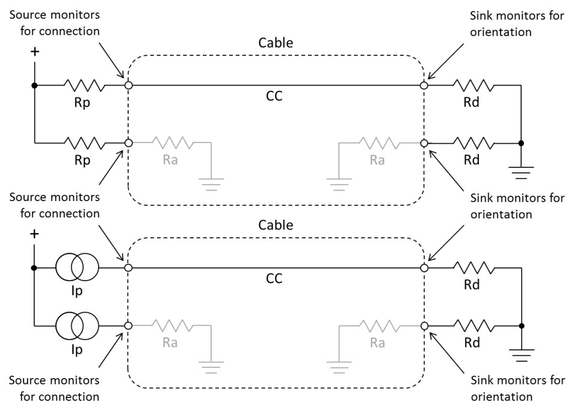

* Source在其CC1与CC2引脚上连接上拉电阻Rp，Sink在其CC1和CC2引脚上连接下拉电阻Rd。Source监测到CC电压低于上拉电压时，表明发生了连接
* 有源电缆中VCONN引脚上连接下拉电阻Ra，Ra表示VCONN上的负载加上对地的电阻。有些电缆插头中Ra可能是纯电阻，有些可能只是负载
* Source必须能够区分Rd与Ra以识别是Sink连接还是需要VCONN供电，Source只有检测到Ra才会向VCONN供电
* 两种附件模式：CC1与CC2均连接Ra为音频适配器附件模式，均连接Rd为调试附件模式

下表总结了不同CC状态下的端口行为
CC1/CC2|状态|Source行为|Sink行为
-|-|-|-
开路/开路|无连接|监测CC引脚以识别连接，不开启VBUS及VCONN供电|监测VBUS以识别连接
Rd/开路、开路/Rd|Sink连接|监测CC以确定方向，监测CC以识别分离，开启VBUS及VCONN供电|监测CC以确定方向，监测VBUS以识别分离
开路/Ra、Ra/开路|有源电缆未连接Sink|监测CC以识别连接，不开启VBUS及VCONN供电|监测VBUS以识别连接
Rd/Ra、Ra/Rd|有源电缆且连接Sink、VPA（VCONN供电附件）或VPD（VCONN供电USB设备）|监测CC以确定方向，监测CC以识别分离，开启VBUS及VCONN供电，检测VPD关闭VBUS|如果支持附件或VPD参见Source行为
Rd/Rd|调试附件模式连接|监测CC以识别分离，为调试重新配置|监测VBUS以识别分离，为调试重新配置
Ra/Ra|音频适配器附件模式连接|监测CC以识别分离，为模拟音频重新配置|如果支持附件参见Source行为

#### 电源角色和数据角色交换机制

Type-C端口电源角色包含以下七种
* Source-only
* Source（Default），初始建立连接时为Source（Try.SRC机制），随后能够使用USB PD交换机制成为Sink
* Sink-only
* Sink（Default），初始建立连接时为Sink（Try.SNK机制），随后能够使用USB PD交换机制成为Source
* DRP，Toggling（Source/Sink）
* DRP，Sourcing Device
* DRP，Sinking Host

Type-C端口有两种独立的角色交换机制，一个是基于初始连接状态机的角色交换，另一个是后续基于USB PD的角色交换
* 初始连接过程中，根据端口上下拉情况有以下两种状态
  * Rp上拉，Source（为VBUS及VCONN供电）、DFP（USB Host）
  * Rd下拉，Sink、UFP（USB Device）
* Try.SRC与Try.SNK机制
  * Try.SRC允许一个DRP初始连接另一个DRP时默认成为Source，Try.SNK允许一个DRP初始连接另一个DRP时默认成为Sink
  * Try.SRC与Try.SNK机制只能在初始连接过程中使用一次
  * Try.SRC和Try.SNK旨在确保最初连接两个DRP时提供可预测的电源角色，尤其是在对端不支持USB PD的情况下。例如，小型移动设备可能希望实现Try.SNK，以便在连接到笔记本电脑（DRP）时，初始作为Sink。同样，笔记本电脑或移动电源可能希望实现Try.SRC，以确保初始状态它为与其连接的DRP设备供电。如果双方都支持USB PD，则可以根据USB PD协议进一步细化或交换适当的角色
* 基于PD的角色交换
  * PR_Swap，交换Source/Sink，不会影响DFP/UFP以及VCONN
  * DR_Swap，交换DFP（Host）/UFP（Device），不会影响Source/Sink以及VCONN
  * VCONN_Swap，交换哪个端口给VCONN供电，不会影响Source/Sink以及DFP/UFP

#### DRP配置通道功能模型

下图显示了CC1与CC2的DRP功能模型
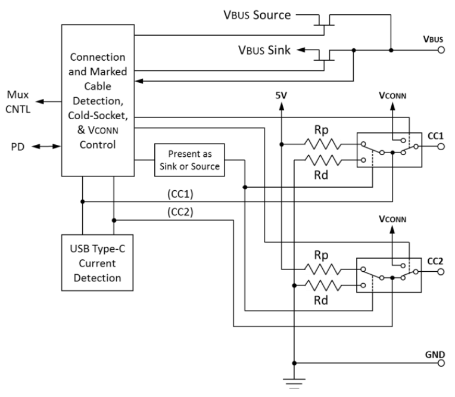

结合上图示意，DRP端口具有以下功能特征
* DRP使用FET来启用/禁用VBUS上的功率传输，且Source模式下初始禁用VBUS输出
* DRP使用开关切换Rp或Rd的连接来设置Source或Sink角色
* DRP在初始连接期间具有在Source和Sink之间切换的逻辑
  * 在建立特定的稳定状态之前，DRP在Source和Sink状态之间交替。此过程的时序由交替周期（tDRP）、Rp百分比（dcSRC.DRP）和角色切换时间（tDRPTransition）决定
  * DRP当前状态为Source时，它遵循Source操作来检测Sink的连接。如果检测到Sink连接，使能VBUS与VCONN，然后停止交替并继续执行Source的相关操作
  * DRP当前状态为Sink时，它监测VBUS来检测是否连接至Source。如果检测到Source，停止交替并继续执行Sink的相关操作
* 如果DRP支持其他高级功能，则需要USB PD通信

下图显示了与DRP切换过程相关的时序参数，具体说明见下表
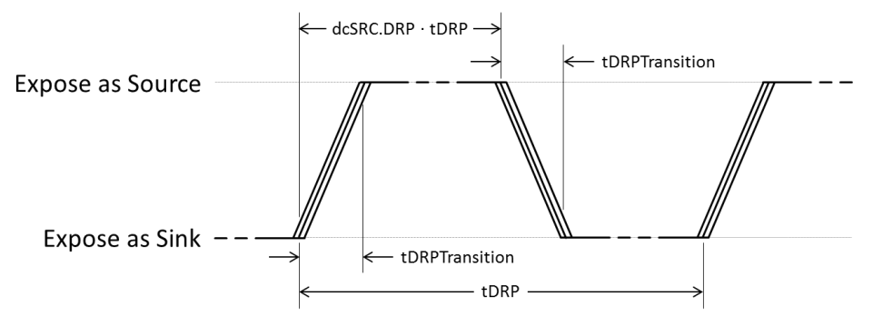

参数|最小值|最大值|说明
-|-|-|-
tDRP|50ms|100ms|角色切换的周期，此时间内应完成一次角色切换
dcSRC.DRP|30%|70%|周期内Source时间所占百分比
tDRPTransition|0ms|1ms|Source与Sink角色切换时间

#### 电源协商
电源协商优先顺序见下表
优先级|操作方式|电压|最大电流
-|-|-|-
最高|USB PD|可配置|5A
↓|USB Type-C@3.0A|5V|3.0A
↓|USB Type-C@1.5A|5V|1.5A
↓|USB BC 1.2|5V|最高1.5A
↓|默认USB电源（USB3.2）|5V|详见USB3.2规范
最低|默认USB电源（USB2.0）|5V|详见USB2.0规范

上表中USB Type-C有两种电流规格，这是Source通过Rp来设置的，详见下表（注意Sink端的Rd固定5.1kΩ）
电源级别|电流源1.7-5.5V|上拉4.75-5.5V时的Rp|上拉3.3V±5%时的Rp
-|-|-|-
默认USB电源|80uA±20%|56kΩ±20%|36kΩ±20%
1.5A@5V|180uA±8%|22kΩ±5%|12kΩ±5%
3.0A@5V|330uA±8%|10kΩ±5%|4.7kΩ±5%

#### 音频适配器附件模式

在音频适配器附件模式下，通过将四个模拟音频信号多路复用到USB Type-C连接器上的引脚上来支持模拟音频耳机。四个模拟音频信号与传统3.5毫米耳机插孔使用的信号相同，这样就可以将现有的模拟耳机通过3.5毫米接口转USB Type-C适配器连接至Type-C接口使用。此外音频适配器架构允许音频外设向系统提供高达500mA的电流进行充电。

模拟音频适配器可以是只有3.5毫米插孔的基本USB Type-C适配器，也可以是带有3.5毫米插孔和USB Type-C插座的模拟音频适配器，以实现充电。模拟音频耳机不得使用USB Type-C插头替换3.5毫米插头，但实际目前有不少这种产品。

支持USB Type-C模拟音频适配器附件模式的主机或设备，还应支持USB Type-C数字音频（TCDA）

模拟音频适配器应通过在USB Type-C插头的A5（CC）和B5（VCONN）上提供小于Ra的对地电阻来标识自身。如果引脚A5和 B5短接在一起，则对GND的有效电阻应小于Ra/2。支持模拟音频适配器的DFP应通过检测A5（CC）和B5（VCONN）上小于Ra 的对GND电阻来检测模拟音频适配器的存在

在音频适配器附件模式下，系统不应在CC1或CC2上提供VCONN供电，否则可能会导致VCONN与GND短路

下表为模拟音频引脚分配
引脚|名称|模拟音频功能|3.5mm接口功能|说明
-|-|-|-|-
A5|CC|-|-|对GND下拉电阻≤Ra，用于检测模拟音频适配器的存在
B5|VCONN|-|-|对GND下拉电阻≤Ra，用于检测模拟音频适配器的存在
A6/B6|D+|Right|Ring1|模拟音频右声道，适配器中A6和B6应短接在一起
A7/B7|D-|Left|Tip|模拟音频左声道，适配器中A7和B7应短接在一起
A8|SBU1|MIC/AGND|Ring2|模拟音频麦克风或者模拟音频地
B8|SBU2|AGND/MIC|Sleeve|模拟音频地或者模拟音频麦克风
A1/A12/B1/B12|GND|-|-|数字地/电源地
A4/A9/B4/B9|VBUS|-|-|适配器同时支持充电时使用
其他|-|-|-|不得连接其他未使用引脚

下图说明了如何制作无源3.5mm接口转模拟音频适配器。在此设计中，有一个音频插头，其中包含一个单极检测开关，用于在未插入3.5mm插头时完全断开CC和VCONN引脚与GND的连接。这会在插入或拔出3.5mm插头或音频适配器本身时触发USB Type-C存在检测逻辑
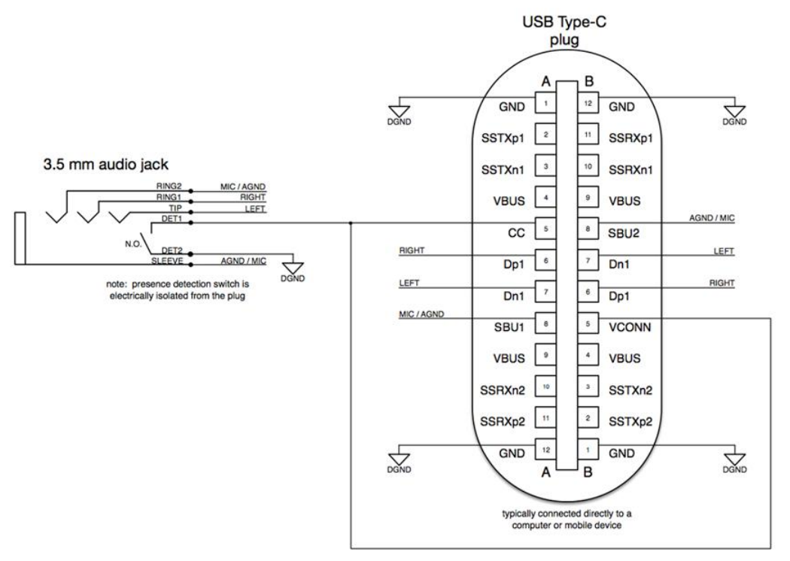

### PD快充
由上文所述输入电流与充电电流的关系可知，要加快充电速度（提高充电电流）可以提高输入电流或者提高输入电压。输入电流受USB线材等限制不能一直提升，此时便需要提高输入电压了。USB标准电压是5V，如果适配器直接输出高于5V的电压而设备不支持时则有可能损坏设备。因此适配器与设备之间需要进行沟通，适配器默认输出5V，然后设备获取适配器有哪些输出能力，选择一个合适的配置并告知适配器，此时适配器才会输出对应电压。PD协议（Power Delivery Specification）便可用于实现上述协商过程。

PD协议通信使用单线物理链路，对于PD3.0使用CC（Configuration Channel配置通道）线，因此理论上双端Type-C才能支持，对于PD2.0及之前的版本则可以是CC线或者Vbus线。使用Vbus在电源上载波的方式由于稳定性等问题实际并没有广泛应用，对于Type-A接口又支持PD的情况更可能使用的是包含CC线的非标准接口。例如小米手机充电器上便是A口却支持PD快充。这是通过在标准A口上增加CC触点，使用定制的A转C的线实现的，但这样其实并不符合PD规范，应该也过不了USB-IF协会的认证。下文中PD相关内容主要翻译自PD2.0_V1.3版本

#### PD端口 
Source与Sink
* PD连接中供电的一端称为Source，耗电的一端称为Sink，每个PD连接中只有一个Source端口和一个Sink端口
* 在初始连接时，Source端口（带有上拉电阻Rp的端口）也是DFP和VCONN Source，Sink端口（带有下拉电阻Rd的端口）也是 UFP
* Source/Sink角色、DFP/UFP角色和VCONN Source角色随后都可以相互交换

DFP与UFP
* DFP（Downstream Facing Port）下行端口，有USB通信功能时作为USB主机。端口无通信功能时也可以是DFP，例如充电器
* UFP（Upstream Facing Port）上行端口，有USB通信功能时作为USB设备。端口无通信功能时也可以是UFP，例如可充电设备

DRP与DRD
* DRP（Dual-Role Power Port）双角色电源端口，同时支持Source和Sink，可以在Source和Sink角色之间切换
* DRD（Dual-Role Data Port）双角色数据端口，同时支持DFP和UFP，可以在DFP和UFP角色之间切换
* 一个端口可以是DRP或DRD也可以同时支持二者。例如一个固定Source端口可以是DRD端口，则可在DFP和UFP间切换

##### Source端口在不同状态下的相关操作如下
* 插入时
  * 对于Source端口检测Sink的连接
  * 对于DRP端口检测到Sink连接时切换至Source
  * Vbus输出vSafe5V（最小4.75V最大5.5V，不同USB版本可能略有差异）
* 建立PD连接前
  * Source检测插入电缆的类型并根据电缆类型及自身供电能力配置电源能力消息（Source_Capabilities）
    * 对于A型和B型插头，通过插头检测确定电缆载流能力（详见上文适配器检测章节）
    * 对于C型插头默认为3A，且DFP会尝试通过SOP'包与电缆（电缆插头中的eMarker芯片）通信，如果有响应则进一步获取电缆载流能力
  * Source通过Source_Capabilities消息定期发布其供电能力
* 准备建立PD连接
  * 通过以下方式检测到支持PD的端口
    * 接收到了响应Source_Capabilities消息的GoodCRC消息
    * 接收到了硬复位（Hard Reset）信号
* 建立PD连接（尚未完成供电协商）
  * Source接收Sink的请求消息（Request），如果是有效请求，则响应接受消息（Accept）。然后在准备好以约定的电压电流供电时发出PS_RDY消息，此时即完成了供电协商
  * DFP不会生成SOP'或SOP"数据包，也不需要检测SOP'或SOP"数据包，如果收到的话直接丢弃
* PD连接已建立（完成供电协商）
  * Source处理并响应（如果需要响应）收到的所有消息，并在需要时发送相应的消息
    * 每当Source的供电能力发生变化时，向Sink发送Source_Capabilities消息
    * Source始终在CC线上连接Rp
    * 端口是DRP时，Source可以发起或接收电源角色交换请求。电源角色交换后，此端口变为Sink
    * 端口是DRD时，Source可以发起或接收数据角色交换请求。数据角色交换后，DFP（主机）变为 UFP（设备），端口仍然是Source，且VCONN Source角色保持不变
    * Source可以发起或接收交换VCONN Source的请求。在VCONN交换期间，两端都要使能VCONN。交换后Source端口仍为Source，DFP/UFP角色也保持不变
  * Source端口也是DFP时
    * Source可以启动非结构化或结构化VDM（厂商自定义消息）
    * Source以控制Sink中不同模式的进入和退出，并使用结构化VDM控制模式操作（Modal Operation）
    * 如果Source在SOP'或SOP"的通信过程中收到SOP包，SOP'或SOP"通信会立刻终止
    * 如果Source需要在正在进行的SOP'或SOP"通信期间启动SOP通信，则SOP'或SOP"通信将被中断
    * Source可以控制电缆插头工作模式的进入和退出，以及控制模式操作
* GotoMin请求、插头分离或通信失败时
  * Source检测到插头分离时，在tSafe5V时间内将Vbus电压降至vSafe5V（最小4.75V最大5.5V），tSafe0V时间内将Vbus电压降至vSafe0V（最大0.65V）
  * tReceive时间内不能正确收到GoodCRC消息时
    * 发起软复位（Soft Reset）
    * 软复位失败则发起硬复位，Source同时也是VCONN Source的话VCONN也会在硬复位期间重新上电
    * 进一步尝试通信仍失败的话则转错误处理
  * 电源转换期间的错误会导致硬复位，以将电源恢复至默认水平
* 错误处理
  * 协议错误通过由任意端口产生的软复位消息处理，会重置计数器、定时器和工作状态，但不会改变已协商的电压电流或端口角色，也不会导致当前活动模式退出
  * 严重错误通过由任意端口产生的硬复位信号处理
    * 在软复位的基础上还会将电源恢复至默认状态（vSafe0V或vSafe5V）以保护Sink
    * 恢复端口的数据角色至DFP
    * 此时Sink为VCONN Source的话则切换Source为VCONN Source
    * 退出所有活动模式
    * 硬复位之后对端应在规定时间之内响应，未响应的话会再尝试重复复位2次

##### Sink端口在不同状态下的相关操作如下
* 插入时
  * 通过识别vSafe5V来检测Source的连接
  * 对于DRP端口检测到Source连接时切换至Sink
  * Sink一旦在Vbus上检测到vSafe5V就会等待电源能力消息（Source_Capabilities）
  * 在规定时间内未收到电源能力消息，则发出硬复位信号以便Source支持PD的话能够发出Source_Capabilities消息
  * Sink不会生成SOP'或SOP"数据包，也不需要检测或识别SOP'、SOP"数据包
* 准备建立PD连接
  * 接收Source_Capabilities消息并应答GoodCRC消息
  * Sink不会生成SOP'或SOP"数据包，也不需要检测SOP'或SOP"数据包，如果收到的话直接丢弃
* 建立PD连接（尚未完成供电协商）
  * Sink接收到Source_Capabilities消息后应答一个Request消息，如果Request消息有效则Sink会再收到一个Accept消息，接下来Source准备好约定的供电级别后发送一条PS_RDY消息。此时Source和Sink之间便完成了供电协商
    * Sink可以向Source请求其提供的供电能力之一，包括vSafe5V
      * 对于A型和B型插头，请求受限于检测到的电缆载流能力
      * 对于C型插头请求从Source提供的电源能力中选择
      * Request消息中不包含任何有效的电源能力请求会导致错误
    * Source提供的所有电源能力都不能支持Sink全功率运行时，Sink请求默认电源并置位不匹配标志，同时可在用户端做一个物理的失败指示（例如LED）
    * Sink不会生成SOP'或SOP"数据包，也不需要检测SOP'或SOP"数据包，如果收到的话直接丢弃
* PD连接已建立（完成供电协商）
  * Sink处理并响应（如果需要响应）收到的所有消息，并在需要时发送相应的消息
  * Sink电源需求更改时会通过新的Request消息向Source申请。Sink端口可以请求Source之前提供的电源能力之一，包括vSafe5V
    * Request消息中不包含任何有效的电源能力请求会导致错误
    * Source提供的所有电源能力都不能支持Sink全功率运行时，Sink请求默认电源并置位不匹配标志，同时可在用户端做一个物理的失败指示（例如LED）
  * Sink始终在CC线上连接Rd
  * 端口是DRD时，Sink可以发起或接收数据角色交换请求。数据角色交换后，DFP（主机）变为 UFP（设备），端口仍然是Sink，且VCONN Source角色保持不变
  * Sink可以发起或接收交换VCONN Source的请求。在VCONN交换期间，两端都要使能VCONN。交换后端口仍为Sink，DFP/UFP角色也保持不变
  * Sink端口也是DFP时
    * Sink可以发起非结构化或结构化VDM（厂商自定义消息）
    * Sink以控制Source中不同模式的进入和退出，并使用结构化VDM控制模式操作（Modal Operation）
* 插头分离或通信失败时
  * Sink检测Vbus的移除并将其作为PD连接的结束
    * 除非vSafe0V是由于硬复位、电源角色交换或快速角色交换造成的
  * Sink检测插头移除并将Vbus放电
  * Sink未在规定时间内收到GoodCRC消息时
    * 发起软复位
    * 软复位失败则发起硬复位
    * 进一步尝试通信仍失败的话则转错误处理
  * 电源转换期间的错误会导致硬复位，以将电源恢复至默认水平
* 错误处理
  * 协议错误通过由任意端口产生的软复位消息处理，会重置计数器、定时器和工作状态，但不会改变已协商的电压电流或端口角色，也不会导致当前活动模式退出
  * 严重错误通过由任意端口产生的硬复位信号处理
    * 在软复位的基础上还会将电源恢复至默认状态（vSafe0V或vSafe5V）以保护Sink
    * 恢复端口的数据角色至UFP
    * 此时Sink为VCONN Source的话则切换Source为VCONN Source
    * 退出所有活动模式
    * 硬复位之后对端应在规定时间之内响应，未响应的话会再尝试重复复位2次

##### 电缆插头（Cable Plugs）相关操作如下
* VCONN有效即对电缆插头供电，电缆插头并不知道PD连接的状态
* 电缆插头不主动发起消息，只对收到的消息进行响应
* 插头分离或通信失败时
  * 通信随时都可能被中断
  * DFP和电缆插头之间的通信不进行超时处理
  * 电缆插头随时响应潜在的重复请求
* 错误处理
  * 电缆插头检测硬复位信号时需要自行复位
    * 电缆插头本身无法产生硬复位信号
    * 硬复位时Vbus和VCONN都会重启，因此电缆插头需自行复位
  * 电缆插头检测电缆复位（Cable Reset）信号以决定是否需要复位自己

#### PD物理层
USBPD物理层包括一对收发器通过单根信号线（Vbus或CC线）进行半双工通信

##### 物理层功能
* 发送端
  * 从协议层接收数据包
  * 计算并追加CRC
  * 编码数据包
  * 通过下述方式之一发送数据包（前导码、SOP*、负载数据、CRC和EOP）
    * Vbus，二进制频移键控调制（BFSK）载波
    * CC线，双相标记编码（BMC）
* 接收端
  * 对于BFSK从信道中检测调制载波
  * 恢复时钟并从前导码中锁定数据包
  * 检测SOP*
  * 解码收到的数据
  * 检测EOP并验证CRC
    * 如果CRC有效，将数据包传输至应用层
    * 如果CRC无效，丢弃接收到的数据

##### 符号编码
除前导码外，线路上的所有通信都使用4b5b编码，它将4位数据编码为5位符号进行传输，将5位符号解码为4位数据以供接收器使用。码字包括0-F共16个数据值以及硬复位、EOP等特殊符号（K-code），详见下表
名称|4bit|5bit|说明
-|-|-|-
0|0000|11110|hex data 0
1|0001|01001|hex data 1
2|0010|10100|hex data 2
3|0011|10101|hex data 3
4|0100|01010|hex data 4
5|0101|01011|hex data 5
6|0110|01110|hex data 6
7|0111|01111|hex data 7
8|1000|10010|hex data 8
9|1001|10011|hex data 9
A|1010|10110|hex data A
B|1011|10111|hex data B
C|1100|11010|hex data C
D|1101|11011|hex data D
E|1110|11100|hex data E
F|1111|11101|hex data F
Sync-1|K-code|11000|Startsynch #1
Sync-2|K-code|10001|Startsynch #2
Sync-3|K-code|00110|Startsynch #3
RST-1 |K-code|00111|Hard Reset #1
RST-2 |K-code|11001|Hard Reset #2
EOP   |K-code|01101|End Of Packet

##### 包格式
前导码+SOP*+消息头+字节数据+CRC+EOP。其中前导码由物理层实现，由交替0和1的64位序列组成，不使用4b5b编码；SOP*、CRC和EOP也由物理层实现，但使用4b5b编码；消息头和字节数据由协议层实现，使用4b5b编码

其中SOP*为SOP、SOP'、SOP"的合称（Start of Packet），SOP用于Source和Sink之间的通信，SOP'/SOP"用于和电缆插头中的电子元件通信。这三个再加上另外4个构成PD协议所使用的7个有序集（即一段固定的编码）。每个有续集由连续4个K-code组成，详见下表
order set|K-code1|K-code2|K-code3|K-code4
-|-|-|-|-
SOP |Sync-1|Sync-1|Sync-1|Sync-2
SOP'|Sync-1|Sync-1|Sync-3|Sync-3
SOP"|Sync-1|Sync-3|Sync-1|Sync-3
SOP'_Debug|Sync-1|RST-2|RST-2|Sync-3
SOP"_Debug|Sync-1|RST-2|Sync-3|Sync-2
Hard Reset|RST-1|RST-1|RST-1|RST-2
Cable Reset|RST-1|Sync-1|RST-1|Sync-3

##### 比特率
比特率|最小|正常|最大|单位
-|-|-|-|-
bit rate|270|300|330|Kbps

#### PD协议层
PD消息包含控制消息与数据消息两种
* 控制消息
  * 长度16bits
* 数据消息
  * 长度48-240bits
  * 发布供电能力协商供电
  * 用于BIST（Built In Self-Test PD物理层测试机制）
  * 厂商自定义消息

控制消息与数据消息的包格式分别如下图所示
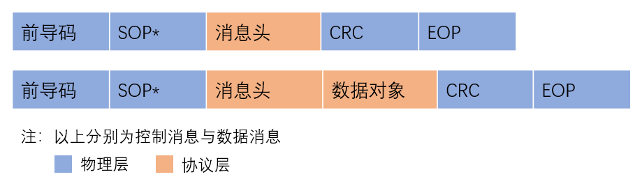

##### 消息头（Message Header）
消息头长度固定为16bit，定义见下表
位|包起始|字段名称|说明
-|-|-|-
15|-|Reserved|保留，应设置为0
12~14|SOP*|Number of Data Objects|数据长度（即数据对象个数，每个数据对象32bit）
9~11|SOP*|MessageID|循环计数，由消息发送方维护，上电或者软硬复位时初始化为0
8|SOP|Port Power Role|端口电源角色，0-Sink，1-Source
8|SOP'/SOP"|Cable Plug|电缆消息标志，0-消息来自DFP/UFP，1-消息来自电缆
6~7 |SOP*|Specification Revision|修订版本，00-Revision1.0，11-Revision2.0
5|SOP|Port Data Role|端口数据角色，0-UFP，1-DFP
5|SOP'/SOP"|Reserved|保留，应设置为0
4|-|Reserved|保留，应设置为0
0~3|SOP*|Message Type|消息类型，先根据数据长度字段确认是控制消息（数据长度为0）还是数据消息

##### 消息类型
控制消息类型定义见下表
值|消息类型|发送端口|说明
-|-|-|-
0001|GoodCRC|Source, Sink or Cable Plug|由接收方发送，以确认前一条消息已正确接收
0010|GotoMin|Source only|旨在允许Source临时进行功率重新分配，Source发送此消息使Sink降低功耗以分配功率给另一个Sink
0011|Accept |Source, Sink or Cable Plug|接受请求
0100|Reject |Source or Sink|拒绝请求
0101|Ping   |Source only|用于Type-A、Type-B，以确定在没有发生其他消息传递时Sink是否仍存在
0110|PS_RDY |Source or Sink|指示电源已达到工作条件
0111|Get_Source_Cap|Source or Sink|获取Source能力以及双角色能力
1000|Get_Sink_Cap|Source or Sink|获取Sink需求及双角色能力
1001|DR_Swap|Source or Sink|交换DFP与UFP角色
1010|PR_Swap|Source or Sink|交换Source与Sink角色
1011|VCONN_Swap|Source or Sink|交换VCONN Source角色
1100|Wait|Source or Sink|表示对于请求不能立即响应
1101|Soft_Reset|Source or Sink|软复位

数据消息类型定义见下表
值|消息类型|发送端口|说明
-|-|-|-
0001|Source_Capabilities|Source or Dual-Role|用于Source发布其供电能力
0010|Request|Sink only|用于Sink请求Source的某一供电能力
0011|BIST|Tester, Source or Sink|用于物理层测试
0100|Sink_Capabilities|Sink or Dual-Role|用于Sink发布其电源需求
1111|Vendor_Defined|Source, Sink or Cable Plug|厂商自定义消息

数据对象（Data Object）类型定义见下表（每个数据对象32bit，一条数据消息可包含1-7个数据对象）
数据对象类型|缩写|说明
-|-|-
BIST Data Object|BDO|BIST数据对象，用于物理层测试
Power Data Object|PDO|电源数据对象，用于发布Source的电源能力或者Sink的电源需求
Request Data Object|RDO|请求数据对象，用于Sink请求电源能力
Vendor Defined Data Object|VDO|厂商定义数据对象，用于描述厂商特定信息

##### Source_Capabilities与Sink_Capabilities消息
Source通过Source_Capabilities消息公开其电源能力，Sink通过Sink_Capabilities消息公开其电源需求，两者都由一个或多个PDO组成。PDO列表中应至少具有一个vSafe5V对象且排在第一个，其他PDO则按照（最小）电压从低到高排列。
Source发送包含一个或多个PDO列表的Source_Capabilities消息，Sink返回包含所需电源PDO索引的RDO消息。此外注意Source和Sink不能协商超过电缆支持最大电流的功率水平。不同角色对Capabilities消息的相关处理如下
* Source
  * 硬复位、上电或者插头插入事件时发送Source_Capabilities消息
  * 响应Get_Source_Cap消息时发送Source_Capabilities消息
* Sink
  * 检测到vSafe5V但规定时间内没有收到Source_Capabilities的话发送硬复位
  * 响应Get_Sink_Cap消息时发送Sink_Capabilities消息
* DRP
  * 作为Source时发送Source_Capabilities消息
  * 无论作为Source/Sink都响应Get_Source_Cap消息
  * 无论作为Source/Sink都响应Get_Sink_Cap消息

Source_Capabilities电源数据对象PDO最高两位（bit30-31）为对象类型，共包含三种类型：00固定电源，01电池，10可调电源

固定电源PDO格式
数据位|描述
-|-
bit30-31|00固定电源
bit29|DRP标志位，此位在Source_Capabilities和Sink_Capabilities中应始终保持一致
bit28|是否支持USB挂起
bit27|功率不受约束
bit26|是否支持USB通信
bit25|DRD标志位，此位在Source_Capabilities和Sink_Capabilities中应始终保持一致
bit22-24|保留
bit20-21|峰值电流（短时过载能力），00表示无过载能力，其他值对应不同等级的过载能力
bit10-19|电压（单位50mV）
bit0-9|最大电流（单位10mA）

注：由于Source总是支持vSafe5V，因此bit22-29只在vSafe5V中设置（第一个PDO），其他固定电源PDO的这些位设置为0。对于不提供输出能力的电源选项，电压设置为5V，电流设置为0mA

可调电源PDO格式
数据位|描述
-|-
bit30-31|10可调电源
bit20-29|最大电压（单位50mV）
bit10-19|最小电压（单位50mV）
bit0-9|最大电流（单位10mA）

电池PDO格式
数据位|描述
-|-
bit30-31|01电池
bit20-29|最大电压（单位50mV）
bit10-19|最小电压（单位50mV）
bit0-9|最大允许功率（单位250mW）

Sink_Capabilities的PDO格式与Source_Capabilities的基本相同，只有bit28含义不同，Sink_Capabilities的bit28为更高能力标志位。即使Sink需要额外的电源才能正常运行，PDO列表中也应该包含一个vSafe5V，这种情况下需要更高能力标志位bit28置位。不需要Source供电的话电压设置为5V，电流设置为0mA

##### Request消息
请求消息应包含一个且仅包含一个请求数据对象（RDO）

固定或可调电源RDO格式
数据位|描述
-|-
bit31|保留，应设置为0
bit28-30|对象位置，Source_Capabilities中PDO的索引（取值1-7）
bit27|GiveBack标志
bit26|不匹配标志，置位表示Source任一电源能力都无法满足Sink的功率需求
bit25|是否支持USB通信
bit24|不支持USB挂起，置位表示USB挂起期间仍需要维持电源供应
bit20-23|保留，应设置为0
bit10-19|固定电源时为工作电流（单位10mA），可变电源时为工作功率（单位250mW）
bit0-9|固定电源时：GiveBack=0时为最大工作电流，1时为最小工作电流（单位10mA）；可调电源时：GiveBack=0时为最大工作功率，1时为最小工作功率（单位250mW）

##### GiveBack与GotoMin功能
Source正在给具有GiveBack功能的Sink临时供电时，也要正常发布Source_Capabilities消息。如果此时有别的Sink发出Request请求消息，Source会应答Wait消息，然后给当前用电的Sink发送GotoMin以收回功率。待功率收回后，再次发出Source_Capabilities以等待新Sink的请求。
此功能通常在电池充电时使用，因为充电的短暂中断对用户的影响最小，从而允许Source更好地管理其负载。

### FUSB302
FUSB302为安森美的一款可编程USB Type-C与PD控制器芯片，可以方便地实现DRP/SRC/SNK等功能。支持Type-C的插拔以及方向检测，集成PD协议物理层BMC编解码、自动GoodCRC，支持角色交换以及最高100W的功率传输。主要特性如下
* 支持Type-C 1.1与PD2.0 v1.1
* 根据连接的设备自动作为Source或Sink
* 支持DRP（自动角色交替或软件控制角色交换）
* 软件可配置为专用主机、专用设备或双角色（支持Try.SRC或Try.SNK）
* 支持音频适配器附件模式
* 支持有源电缆
* 通过I2C接口进行控制与状态查询（要求至少400kHz）

安森美官方提供了FUSB302的驱动库源代码（最新版本[4.1.2](https://www.onsemi.com/products/interfaces/usb-type-c/fusb302b#design-tools)），只要稍作修改便能实现Type-C及PD相关功能

#### 移植关键步骤
* 添加源码
  * 添加驱动库`core`文件夹
* 设置预编译宏进行功能裁剪
  * `FSC_HAVE_SRC`：Source Only
  * `FSC_HAVE_SNK`：Sink Only
  * `FSC_HAVE_SRC、FSC_HAVE_SNK、FSC_HAVE_DRP`：DRP
  * `FSC_HAVE_ACCMODE`：附件模式（例如模拟音频）
  * `FSC_HAVE_VDM`：VDM
  * `FSC_HAVE_DP`：DP
* 修改配置
  * `platform.h`文件中配置定时器TICK（宏定义`TICK_SCALE_TO_MS`）
  * `vendor_info.h`文件中配置默认参数（Source能力、Sink能力、默认角色等参数）
* 类型定义
  * 添加`FSCTypes.h`文件定义类型，可参考驱动库`Platform_ARM\src\FSCTypes.h`
* 添加`platform.c`文件实现平台相关接口
  * `platform_i2c_write`：I2C写寄存器
  * `platform_i2c_read`：I2C读寄存器
  * `platform_set_vbus_lvl_enable`：设置VBUS输出（作为Source时）
  * `platform_get_device_irq_state`：获取FUSB302中断状态
  * `platform_get_system_time`：获取定时器TICK
  * `platform_delay`：延时(单位us)
  * `platform_delay_10us`：延时(单位10us)
* FUSB302初始化及状态机运行
  * 调用驱动库相关初始化函数并注册事件回调函数
  * FUSB302中断以及定时器超时时调用`core_state_machine`函数执行Type-C及PD状态机，并根据需要启动超时定时器
  * 根据需要处理回调函数中的事件

具体操作细节详见本项目代码，并可参考驱动库中的指南文档（AND9686-D.PDF）及例程。本项目配置为DRP且支持ACC模拟音频模式，作为Sink时最高支持9V电压，作为Source时支持输出5V（bq25606的OTG输出）。实测连接小米67W手机充电器成功申请5V和9V供电（使用红外遥控器切换，驱动库默认选择电压允许范围内的最大功率选项，本项目改为直接根据Source能力索引选择，详见`PDPolicy.c`文件`PolicySinkEvaluateCaps`函数），连接Type-C OTG转接头成功输出5V电压，连接Type-C耳机正确识别ACC模式（TODO具体音频功能待实现）

#### I2C接口
I2C总线使用一根时钟线（SCL）和一根数据线（SDA）通信，主机端具体操作如下
* 空闲状态
  * SCL与SDA均为高
* 起始信号
  * SCL为高时SDA下降沿
* 停止信号
  * SCL为高时SDA上升沿
* 写一个字节
  * 从高到低逐位发送数据（SCL为低时设置SDA电平，SCL高时保持SDA）
  * 释放SDA（即开漏输出高），等待ACK信号（由从机将SDA拉低）
* 读一个字节
  * 从高到低逐位接收数据（释放SDA后逐位输出时钟并在SCL高时读取SDA）
  * 发送ACK（SDA拉低）/NACK（SDA拉高）
* 向FUSB302发送数据（参考下图，图片来自[FUSB302数据手册](https://atta.szlcsc.com/upload/public/pdf/source/20200113/C481901_9A95BE9D93C1C4C02FC79A03F46C1050.pdf)）
  * 起始信号
  * 写从机地址（字节最低位为0表示写）
  * 写寄存器地址
  * 循环写字节数据
  * 停止信号
* 读取FUSB302数据（参考下图）
  * 起始信号
  * 写从机地址（字节最低位为0表示写）
  * 写寄存器地址
  * 起始信号
  * 写从机地址（字节最低位为1表示读）
  * 循环读字节数据（前面字节ACK最后一个字节NACK）
  * 停止信号

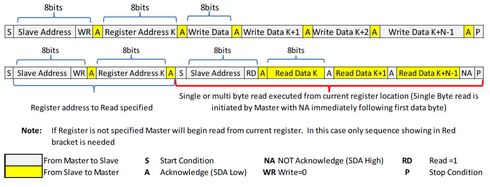

下图是实测的一次写数据通信，从机地址0x22，寄存器地址0x02（Switches0），写入数据0x0B

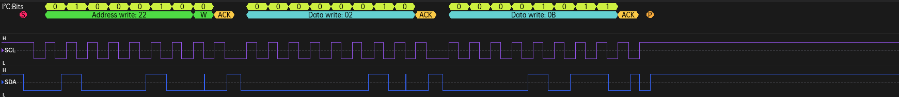

下图是实测的一次读数据通信，从机地址0x22，寄存器地址0x3D（Status1a），读到数据0x28

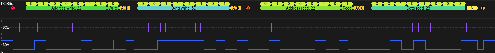

## LCD屏幕(SPI)
使用一块中景园电子的1.14寸彩色TFT液晶屏，分辨率135*240，采用ST7789驱动芯片，4线SPI接口，具体接口定义如下表
序号|接口|说明
-|-|-
1、2、9|NC|
3|SDA|SPI数据线，连接SPI主机MOSI接口
4|SCL|SPI时钟线
5|DCS|数据/命令选择，0写命令 1写数据
6|RST#|复位信号
7|CS#|SPI片选
8|GND|地
10|VCC|3.3V电源
11|LEDK|背光LED-，10Ω电阻接地，串一个NPN以控制背光
12|LEDA|背光LED+，接VCC
13|GND|地

### ST7789
通过SPI向ST7789写入命令及数据，完成显示控制。写命令先将DCS拉低再通过SPI传输指令，写数据先将DCS拉高再通过SPI传输数据。上电后需要先对一些寄存器进行配置，具体参数参考LCD厂商例程

#### 坐标偏移
ST7789显存为240\*320, 此LCD屏幕分辨率为135\*240，居中使用缓存因此需要根据显示方向设置不同的偏移量，例如竖直方向显示时偏移X=40、Y=51（左上原点X向右Y向下）

#### 显示方向
通过寄存器MADCTL（36h）控制显示方向，默认竖直显示（左上原点X向右Y向下），配置MADCTL高三位修改显示方向，定义详见下表

位|名称|说明
-|-|-
bit7|MY|Y方向：0表示向下，1表示向上
bit6|MX|X方向：0表示向右，1表示向左
bit5|MV|1表示交换X与Y

不同显示方向的配置见下表

显示方向|MY|MX|MV|说明
-|-|-|-|-
竖直|0|0|0|默认方向，X向右Y向下
竖直转180°|1|1|0|相对默认X与Y均反向
水平|0|1|1|相对默认先将X反向再交换XY
水平转180°|1|0|1|相对默认先将Y反向再交换XY

#### 图像显示
先设置显示范围，再传输像素数据，步骤如下
* 设置列地址
  * 写命令（列地址寄存器2Ah，1字节）
  * 写数据（X轴起始坐标，2字节）
  * 写数据（X轴结束坐标，2字节）
* 设置行地址
  * 写命令（行地址寄存器2Bh，1字节）
  * 写数据（Y轴起始坐标，2字节）
  * 写数据（Y轴结束坐标，2字节）
* 设置像素数据
  * 写命令（写显存寄存器2Ch，1字节）
  * 写数据（逐像素传输，N字节）

### 调试信息窗口（带滚动条的文本窗口）
实现一个显示调试信息的文本窗口，主要功能如下
* 支持ASCII码中95个可显示字符（' '至'~'）、支持4种字号
* 支持制表符\\t
  * 制表符填充空格，4个字符对齐
* 支持换行符\\n
  * 遇换行符换行显示
* 自动换行
  * 根据显示方向、字号及滚动条宽度计算一行可显示的字符数
  * 单行达到最大显示字符数后自动换行显示
* 多行显示
  * 定义一个文本缓冲区，打印调试信息时追加至缓冲区中文本末尾
  * 缓冲区满时清空重新开始
  * 文本超过一屏时通过上下键调整当前显示的内容
  * 短按滚动一行，长按连续滚动
  * 当前显示最新内容时再打印新的内容则自动滚动至最后
* 滚动条
  * 根据屏幕可显示行数（由字号和显示方向决定）与缓冲区文本总行数（注意包括自动换行产生的行）计算滚动条高度
  * 根据当前显示的行号与总行数计算滚动条位置

显示效果见下图

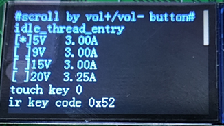


